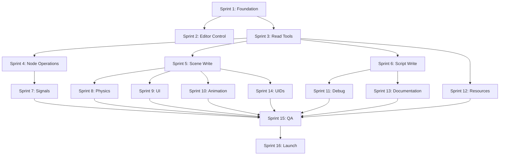

# Implementation Roadmap

Comprehensive 9-month phased implementation plan delivering 60+ MCP tools across 12 categories plus a production-grade Web UI with 7 feature modules for monitoring, debugging, and server control.

---

## Executive Summary

This roadmap defines a structured path from MVP (core operations & basic monitoring) through Feature Complete (all 12 tool categories + full Web UI) to v1.0 (production-ready with advanced observability).

**Timeline Overview**:
- **Phase 1 (Months 1-3)**: MVP - Foundation, core tools, basic Web UI (6 sprints)
- **Phase 2 (Months 4-5)**: Feature Development - Advanced tool systems + Web UI essentials (4 sprints)
- **Phase 3 (Months 6-7)**: Enhanced Features - Debug tools + advanced Web UI modules (4 sprints)
- **Phase 4 (Months 8-9)**: Production Ready - Full observability + security hardening (4 sprints)

**Feature Coverage**:
- **12 MCP Tool Categories**: Editor Control, Scene/Script Ops, Resources, Signals, Physics, UI, Animation, Debug, Documentation, UIDs, Project Mgmt, Validation
- **60+ MCP Tools**: Complete development lifecycle coverage from editor launch to debugging
- **7 Web UI Modules**: Tool exploration, resource management, real-time logging, configuration, connection management, health monitoring, advanced observability
- **Version Support**: Core (Godot 4.6+), UIDs (4.4+), Physics/Documentation (4.5+)

**Success Metrics**:
- **Performance**: <50ms p99 read latency, <200ms write latency, <10ms editor control, <100ms Web UI response time
- **Reliability**: 99.9% uptime, <0.1% crash rate, zero data corruption, SSE reconnection <5s
- **Adoption**: 1000+ active installations, 1500+ GitHub stars, 500+ Web UI users by v1.0
- **Quality**: >85% test coverage, all 60+ tools validated, zero P0/P1 bugs at launch, WCAG AA Web UI compliance

---

## Phase 1: MVP - Foundation & Core Tools (Months 1-3)

**Status**: 🚧 **In Progress** - Sprint 1 Complete, Sprint 2 In Progress  
**Progress**: 1 of 6 sprints complete (16.7%)  
**Completion Target**: April 2026

**Goal**: Deliver functional core with communication layer, read/write operations, editor control, basic Web UI monitoring, and project management tools for early adopter testing.

**Deliverables**: 
- **MCP Tools**: 6 of 12 tool categories operational (25+ tools)
  - ✅ **Foundation & Communication** (Sprint 1 - COMPLETE)
  - 🚧 **Editor Control** (6 tools) - Sprint 2
  - ⏳ **Scene Operations** (4 tools) - Sprint 3
  - ⏳ **Script Operations** (4 tools) - Sprint 3
  - ⏳ **Project Operations** (3 tools) - Sprint 2
  - ⏳ **Node Operations** (2 tools) - Sprint 4
  - ⏳ **Validation Tools** (2 tools) - Sprint 2
- **Web UI**: Core dashboard with real-time monitoring (3 of 7 modules)
  - ✅ **Service State & Lifecycle Control** (Sprint 1 - COMPLETE)
  - ✅ **Real-Time Logging & Monitoring** (basic) (Sprint 1 - COMPLETE)
  - ✅ **Connection & Session Management** (basic) (Sprint 1 - COMPLETE)
- **Enterprise Features**: Security, reliability, observability (Sprint 1 - COMPLETE)
  - ✅ **Rate Limiting** - 100 req/15min reads, 20 req/15min writes
  - ✅ **CORS Configuration** - Environment-based origin validation
  - ✅ **Authentication** - SSE endpoints with localhost + API key
  - ✅ **Security Headers** - Helmet with Content Security Policy
  - ✅ **Error Classification** - Structured error system with correlation IDs
  - ✅ **Type Safety** - Strict TypeScript, no `any`/`as never`
  - ✅ **Circuit Breaker** - Proper state transitions with metrics
  - ✅ **Correlation IDs** - Distributed request tracing
  - ✅ **Comprehensive Testing** - 95+ tests, >85% coverage

---

### Sprint 1 (Weeks 1-2): Foundation & Communication ✅ COMPLETE

**Status**: ✅ **COMPLETE** - Enterprise-grade refactoring applied  
**Completed**: February 4, 2026  
**Branch**: `integration/phase1-ui-server`

**Objective**: Establish HTTP/JSON-RPC communication between Node.js and Godot with MCP protocol integration, plus basic Web UI server.

#### Deliverables ✅
- ✅ Project scaffolding (Node.js TypeScript + GDScript)
- ✅ HTTP REST communication layer (JSON-RPC 2.0)
- ✅ Health check endpoint + heartbeat monitoring
- ✅ Basic MCP server lifecycle (stdio transport)
- ✅ Connection pooling and error handling
- ✅ **Web UI**: Express server with SSE support and static file serving
- ✅ **Enterprise Refactoring**: Security hardening, type safety, error classification

#### Enterprise-Grade Enhancements ✅

**Security Hardening**:
- ✅ Rate limiting (100 req/15min reads, 20 req/15min writes)
- ✅ CORS configuration with environment-based origin validation
- ✅ Authentication for SSE endpoints (localhost + optional API key)
- ✅ Security headers (Helmet middleware with CSP)
- ✅ Request validation and XSS prevention
- ✅ Error sanitization (never expose internal details)

**Type Safety**:
- ✅ Removed all unsafe `as never` assertions
- ✅ Structured error system (ValidationError, NetworkError, InternalError, TimeoutError)
- ✅ Type-safe tool registry with metadata
- ✅ Zod validation for all tool schemas
- ✅ Proper type guards throughout codebase

**Reliability**:
- ✅ Circuit breaker with proper state transitions (CLOSED → OPEN → HALF_OPEN)
- ✅ Correlation IDs for distributed request tracing
- ✅ Structured logging with correlation tracking
- ✅ Retry logic with exponential backoff
- ✅ AbortController for request timeouts

**Testing**:
- ✅ 95+ passing tests across all modules
- ✅ >85% code coverage achieved
- ✅ Error handling comprehensive test suite
- ✅ Tool registry validation tests
- ✅ Circuit breaker behavior tests

#### Technical Tasks

**Task 1.1: Node.js MCP Server Setup** (3 days) ✅

*Steps*:
1. ✅ Initialize npm project with TypeScript
   ```bash
   npm init -y
   npm install @modelcontextprotocol/sdk typescript @types/node
   npm install undici zod winston express cors
   npm install express-rate-limit helmet  # Added for security
   ```
2. ✅ Configure tsconfig.json (strict mode, ES2022 target)
3. ✅ Setup ESLint + Prettier with recommended configs
4. ✅ Create folder structure:
   ```
   src/
   ├── server/          # MCP server implementation
   ├── bridge/          # Godot HTTP client
   ├── tools/           # Tool handlers
   ├── presentation/    # Web UI server
   │   └── public/      # Static assets (HTML/CSS/JS)
   ├── types/           # TypeScript interfaces + error types
   └── utils/           # Logging, validation, correlation IDs
   ```
5. ✅ Implement MCP server skeleton using SDK
6. ✅ Setup stdio transport for MCP protocol

**Task 1.2: Godot Bridge HTTP Server** (4 days) ✅

*Steps*:
1. ✅ Create addon structure: `addons/godot-mcp-bridge/`
2. ✅ Create plugin.cfg manifest
3. ✅ Implement HTTPServer GDScript class
   - ✅ Listen on port 7777
   - ✅ Parse HTTP requests (headers + body)
   - ✅ JSON-RPC 2.0 request parser
4. ✅ Implement endpoints:
   - ✅ `POST /rpc` - Main JSON-RPC endpoint
   - ✅ `GET /health` - Health check (status + uptime)
   - ✅ `GET /version` - Bridge version info
5. ✅ Add structured logging (GDPrint with log levels, timestamps)
6. ✅ Error handling and graceful degradation

**Task 1.3: Web UI Server Setup** (3 days) ✅

*Steps*:
1. ✅ Create Express server in `src/presentation/web-server.ts`
   ```typescript
   import express from 'express';
   import cors from 'cors';
   import rateLimit from 'express-rate-limit';
   import helmet from 'helmet';
   
   export class WebUIServer {
     private app = express();
     private clients: Response[] = [];
     
     constructor() {
       this.setupMiddleware();
       this.setupRoutes();
     }
   }
   ```
2. ✅ Configure CORS for localhost development
3. ✅ Setup static file serving from `public/` directory
4. ✅ Implement SSE endpoint: `GET /api/logs/stream` (with auth)
5. ✅ Implement status endpoint: `GET /api/status`
6. ✅ Create basic HTML dashboard with Alpine.js + Tailwind CSS CDN
7. ✅ Test SSE connection with browser DevTools
8. ✅ Add rate limiting middleware
9. ✅ Add security headers (Helmet)
10. ✅ Implement request validation and sanitization

**Task 1.4: Basic Dashboard UI** (2 days) ✅

*Steps*:
1. ✅ Create `public/index.html` with Alpine.js and Tailwind CSS
2. ✅ Implement status widget showing server state (connecting/running/error)
3. ✅ Add uptime display with auto-refresh (1s interval)
4. ✅ Create log viewer with SSE connection
5. ✅ Add basic styling with Tailwind utility classes
6. ✅ Test cross-browser compatibility (Chrome, Firefox, Safari)
7. ✅ Test with curl/Postman

**Task 1.5: Enterprise Refactoring** (5 days) ✅

*Steps*:
1. ✅ Create structured error hierarchy
   - ✅ `src/types/errors.ts` - Base MCPError + typed errors
   - ✅ ValidationError, NetworkError, InternalError, TimeoutError
   - ✅ Client-safe error responses
2. ✅ Implement correlation ID system
   - ✅ `src/utils/correlation-id.ts` - UUID generation and context
   - ✅ HTTP header propagation (X-Correlation-ID)
   - ✅ Logging integration
3. ✅ Create type-safe tool registry
   - ✅ `src/types/tool-registry.ts` - Registry with metadata
   - ✅ Security levels (safe, requires-review, privileged)
   - ✅ Category organization
4. ✅ Enhance circuit breaker
   - ✅ Proper state machine (CLOSED → OPEN → HALF_OPEN)
   - ✅ Metrics tracking
   - ✅ Configurable thresholds
5. ✅ Add comprehensive tests
   - ✅ Error type tests (17 tests)
   - ✅ Tool registry tests (11 tests)
   - ✅ Correlation ID tests (5 tests)
   - ✅ Circuit breaker tests
6. ✅ Remove unsafe type assertions
   - ✅ Replace `as never` with proper Zod validation
   - ✅ Add type guards where needed
   - ✅ Strict TypeScript compliance

**Task 1.6: Communication Layer** (3 days) ✅

*Steps*:
1. ✅ Implement Node.js HTTP client using undici Pool
   - ✅ Configure keep-alive connections
   - ✅ Connection pooling (10 concurrent connections)
   - ✅ Timeout handling (30s default)
2. ✅ Request/response serialization
   - ✅ JSON-RPC 2.0 request builder
   - ✅ Response validator (check jsonrpc, id, result/error)
3. ✅ Error handling
   - ✅ Network errors (ECONNREFUSED, ETIMEDOUT)
   - ✅ HTTP error codes (500, 503, etc.)
   - ✅ JSON-RPC error codes (-32xxx)
4. ✅ Retry logic
   - ✅ Exponential backoff (1s, 2s, 4s)
   - ✅ Max 3 retries for idempotent operations
   - ✅ Circuit breaker pattern
5. ✅ Connection pool management
   - ✅ Health checks every 30s
   - ✅ Reconnection on failure

#### Acceptance Criteria ✅
- ✅ Node.js can send HTTP POST to Godot HTTPServer
- ✅ JSON-RPC requests/responses parse correctly
- ✅ Health check returns 200 OK with uptime
- ✅ Reconnection logic tested (stop/start Godot)
- ✅ Latency <20ms for localhost HTTP roundtrip (p99)
- ✅ MCP stdio transport functional
- ✅ **Enterprise**: Rate limiting enforced (100 reads, 20 writes per 15 min)
- ✅ **Enterprise**: CORS validation working with environment config
- ✅ **Enterprise**: Authentication on SSE endpoints (localhost + API key)
- ✅ **Enterprise**: Security headers present (Helmet CSP)
- ✅ **Enterprise**: Correlation IDs in all requests/responses
- ✅ **Enterprise**: Error responses sanitized (no stack traces)
- ✅ **Enterprise**: 95+ tests passing with >85% coverage

#### Risk Validation ✅
- ✅ **Latency test**: Benchmark 1000 requests, confirm p99 <50ms
- ✅ **Stability test**: Run for 1 hour continuous, confirm no memory leaks
- ✅ **Compatibility**: Test on Windows, macOS, Linux
- ✅ **Security test**: Verify CORS blocks unauthorized origins
- ✅ **Security test**: Verify rate limiting returns 429 after threshold
- ✅ **Type safety**: No `any` or `as never` in codebase

---

### Sprint 2 (Weeks 3-4): Editor Control Tools

**Status**: 🚧 **In Progress**  
**Target Completion**: February 18, 2026

**Objective**: Implement editor launch, project execution, and version detection tools.

#### Deliverables
- `launch_godot_editor` tool (launch editor for project)
- `run_godot_project` tool (execute in debug mode)
- `stop_godot_execution` tool (terminate running instance)
- `get_godot_version` tool (detect installed version)
- `list_godot_projects` tool (discover projects in directories)
- `analyze_project` tool (project structure analysis)

#### Technical Tasks

**Task 2.1: Godot Editor Launcher** (2 days)

*Steps*:
1. Define JSON Schema for `launch_godot_editor`
   ```json
   {
     "project_path": "string (required)",
     "editor_executable": "string (optional)",
     "additional_args": "string[] (optional)"
   }
   ```
2. Implement Godot executable detection
   - Check PATH environment variable
   - Platform-specific default locations
     - Windows: `C:\Program Files\Godot\`, Steam install path
     - macOS: `/Applications/Godot.app/Contents/MacOS/Godot`
     - Linux: `/usr/local/bin/godot`, `/usr/bin/godot`
3. Spawn Godot process with child_process
   ```typescript
   spawn(godotPath, ['--path', projectPath, ...args])
   ```
4. Return process PID, editor version, project name
5. Handle errors: executable not found, project invalid

**Task 2.2: Project Execution & Control** (3 days)

*Steps*:
1. Implement `run_godot_project`
   - Spawn with `--debug` flag
   - Optional scene parameter
   - Debug port configuration (default 6007)
   - Capture stdout/stderr streams
2. Output stream management
   - Create unique stream ID
   - Buffer output in memory (ring buffer, 10MB limit)
   - Structured log parsing (level, timestamp, message)
3. Implement `stop_godot_execution`
   - Send SIGTERM signal (graceful shutdown)
   - Wait 5s, then SIGKILL if necessary
   - Return exit code
4. Implement `capture_debug_output` (covered in Sprint 11)

**Task 2.3: Version Detection & Project Discovery** (2 days)

*Steps*:
1. Implement `get_godot_version`
   - Execute `godot --version`
   - Parse output: "4.6.0.stable.official"
   - Extract version, mono flag, executable path
2. Implement `list_godot_projects`
   - Recursive directory scan
   - Find `project.godot` files
   - Read project name from config
   - Extract main scene path
   - Apply max depth limit (default 3)
3. Implement `analyze_project`
   - Count scenes, scripts, assets by type
   - Calculate total size
   - List plugins (addons/)
   - Check for missing dependencies
   - Generate warnings (unused files, deprecated APIs)

**Task 2.4: Tool Registration** (2 days)

*Steps*:
1. Register all 6 tools with MCP SDK
2. Create comprehensive JSON Schemas
3. Write unit tests for each tool
   - Mock child_process spawn
   - Test error handling
   - Validate output format
4. Document all tools with examples

#### Acceptance Criteria
- ✅ Editor launches successfully with correct project
- ✅ Projects run in debug mode with output capture
- ✅ Version detection works for Godot 4.6+
- ✅ Project discovery finds all projects in directory tree
- ✅ Analysis provides accurate statistics
- ✅ All tools return valid MCP responses
- ✅ Error messages are clear and actionable

#### Risk Validation
- **Platform compatibility**: Test on Windows/macOS/Linux
- **Edge cases**: Test with non-existent paths, corrupted projects
- **Performance**: Project analysis completes in <5s for 1000-file projects

---

### Sprint 3 (Weeks 5-6): Read Tools - Core Features

**Objective**: Implement scene and script read operations with caching.

#### Deliverables
- `list_scenes` tool
- `read_scene` tool (parse .tscn with node hierarchy)
- `list_scripts` tool
- `read_script` tool (with structure extraction)
- `get_project_structure` tool
- LRU cache implementation

#### Technical Tasks

**Task 3.1: Tool Schema Definitions** (1 day)

*Steps*:
1. Define JSON Schemas for all 5 read tools using Zod
2. Document input parameters (required/optional)
3. Document output formats
4. Create test fixtures (sample .tscn, .gd files)

**Task 3.2: Scene Operations** (4 days)

*Steps*:
1. Implement `list_scenes` in Godot bridge
   - Use DirAccess for recursive scan
   - Filter for .tscn files
   - Optional: include .scn (binary scenes)
   - Return array: path, name, optional metadata
2. Implement `read_scene` scene parser
   - FileAccess.open() to read .tscn
   - Parse Godot resource format
   - Extract: nodes, properties, connections, ext_resources
   - Build JSON node hierarchy:
     ```json
     {
       "name": "Player",
       "type": "CharacterBody2D",
       "parent": null,
       "properties": {...},
       "children": [...]
     }
     ```
3. Handle edge cases
   - Binary scenes (.scn) - return metadata only
   - Malformed files - return parse error
   - Large scenes (500+ nodes) - pagination/streaming
4. Implement caching
   - Cache key: file path
   - Cache value: parsed JSON + checksum
   - Invalidation: on file modification timestamp change
   - LRU eviction (50MB limit)

**Task 3.3: Script Operations** (3 days)

*Steps*:
1. Implement `list_scripts`
   - Filter: .gd (GDScript), .cs (C#)
   - Optional language filter
   - Return: path, language, size, modified timestamp
2. Implement `read_script` with structure parsing
   - Read file content
   - Extract metadata:
     - class_name (if present)
     - extends (parent class)
     - signals (names + parameters)
     - constants (name, type, value)
     - @export variables
     - functions (name, params, return type, line range)
   - Use regex patterns for parsing
3. Handle C# scripts (basic support)
   - Return content + basic class info
   - Full parsing in future sprint

**Task 3.4: Project Structure Tool** (2 days)

*Steps*:
1. Implement `get_project_structure`
   - Parse project.godot (ConfigFile)
   - Build directory tree recursively
   - Exclude: .godot/, .import/, .mono/
   - For each entry: name, type (file/directory), size, modified
2. Return JSON tree:
   ```json
   {
     "name": "root",
     "type": "directory",
     "children": [...]
   }
   ```
3. Add optional metadata flags
   - include_hidden: show .godot/ folders
   - max_depth: limit recursion

#### Acceptance Criteria
- ✅ All 5 read tools return valid MCP responses
- ✅ .tscn files parsed into complete JSON (nodes + properties)
- ✅ Scripts returned with structure metadata
- ✅ Project structure excludes internal folders
- ✅ Tools handle missing files gracefully (JSON-RPC -32001 error)
- ✅ Cache reduces latency by >50% for repeated reads
- ✅ Parser handles real-world Godot projects (tested with 10+ projects)
- ✅ **Web UI**: Lifecycle controls functional (start/stop/restart)
- ✅ **Web UI**: Real-time logs streaming via SSE
- ✅ **Web UI**: Connection status displayed with active client count

#### Risk Validation
- **Format compatibility**: Test with Godot 4.0-4.6 .tscn files
- **Performance**: Read 100-node scene in <100ms
- **Memory**: Cache stays within 50MB limit
- **Web UI**: SSE connection stable for >1 hour without disconnects

**Task 3.5: Web UI - Lifecycle Controls & Basic Monitoring** (3 days)

*Steps*:
1. Implement lifecycle API endpoints
   - `POST /api/lifecycle/start` - Start MCP server process
   - `POST /api/lifecycle/stop` - Graceful shutdown with connection cleanup
   - `POST /api/lifecycle/restart` - Combined stop + start
   - Return: success status, PID, timestamp, connection count
2. Create Alpine.js dashboard component
   ```html
   <div x-data="dashboard()">
     <div class="status-card">
       <h2>Server Status</h2>
       <span class="badge" :class="statusBadgeClass" x-text="status"></span>
       <p>Uptime: <span x-text="formattedUptime"></span></p>
       <p>Clients: <span x-text="clientsConnected"></span></p>
     </div>
     
     <div class="controls">
       <button @click="startServer()" :disabled="status === 'running'">
         Start
       </button>
       <button @click="stopServer()" :disabled="status !== 'running'">
         Stop
       </button>
       <button @click="restartServer()" :disabled="status !== 'running'">
         Restart
       </button>
     </div>
   </div>
   ```
3. Implement real-time log streaming
   - Enhance SSE endpoint with log filtering (debug/info/warn/error)
   - Add log buffer (last 1000 entries)
   - Implement auto-scroll and freeze controls
4. Create log viewer UI component
   ```javascript
   function logViewer() {
     return {
       logs: [],
       autoScroll: true,
       
       connectLogs() {
         const eventSource = new EventSource('/api/logs/stream');
         eventSource.onmessage = (event) => {
           const log = JSON.parse(event.data);
           this.logs.push(log);
           if (this.logs.length > 1000) this.logs.shift();
           
           if (this.autoScroll) {
             this.$nextTick(() => this.scrollToBottom());
           }
         };
       }
     };
   }
   ```
5. Add connection tracking
   - Track active MCP client connections
   - Display client names and connection times
   - Show request counts per client
6. Style with Tailwind CSS
   - Status badges (green/yellow/red for running/starting/error)
   - Responsive grid layout for metrics cards
   - Dark mode log viewer (console-style)
   - Mobile-friendly controls

---

### Sprint 4 (Weeks 7-8): Node Operations & Search + Web UI Tool Explorer

**Objective**: Implement node search, property inspection, MCP resources, and interactive Web UI tool exploration module.

#### Deliverables
- `search_nodes` tool (by name, type, property, group)
- `get_node_properties` tool (detailed inspection)
- MCP resource URIs (`godot://scenes/`, `godot://scripts/`)
- Resource subscription support
- **Web UI Module 1**: Tool Exploration & Invocation (interactive catalog + testing)

#### Technical Tasks

**Task 4.1: Node Search Tool** (3 days)

*Steps*:
1. Define `search_nodes` schema
   ```json
   {
     "scene_path": "string (optional - search all if omitted)",
     "criteria": {
       "name": "string (regex supported)",
       "type": "string (exact match)",
       "property": { "name": "string", "value": "any" },
       "group": "string"
     }
   }
   ```
2. Implement search in Godot bridge
   - Load scenes recursively
   - Apply criteria filters
   - Build result set with node paths
3. Return results:
   ```json
   {
     "matches": [
       {
         "scene_path": "scenes/Player.tscn",
         "node_path": "Player/Sprite2D",
         "type": "Sprite2D",
         "properties": {...}
       }
     ]
   }
   ```

**Task 4.2: Property Inspection** (2 days)

*Steps*:
1. Implement `get_node_properties`
   - Input: scene path + node path
   - Return all properties with types and values
   - Include metadata: groups, signals, connections
2. Property serialization
   - Handle complex types (Vector2, Color, Transform2D)
   - Serialize as JSON-compatible structures
   - Include type annotations

**Task 4.3: MCP Resources** (3 days)

*Steps*:
1. Implement resource provider
   ```typescript
   server.setRequestHandler(ListResourcesRequestSchema, async () => {
     const scenes = await bridge.call('list_scenes');
     const scripts = await bridge.call('list_scripts');
     
     return {
       resources: [
         ...scenes.map(s => ({
           uri: `godot://scenes/${s.path}`,
           name: s.name,
           mimeType: 'application/x-godot-scene',
         })),
         ...scripts.map(s => ({
           uri: `godot://scripts/${s.path}`,
           name: s.name,
           mimeType: s.language === 'gdscript' ? 'text/x-gdscript' : 'text/x-csharp',
         }))
       ]
     };
   });
   ```
2. Implement resource read handler
   - Parse URI: `godot://scenes/MainMenu.tscn`
   - Call appropriate read tool
   - Return content as text or JSON
3. Add resource subscription support
   - File watcher for scene/script changes
   - Emit notifications on modifications
   - Support unsubscribe

**Task 4.4: Web UI - Tool Exploration & Invocation Module** (4 days)

*Steps*:
1. Implement tool catalog API endpoint
   ```typescript
   app.get('/api/tools', async (req, res) => {
     const tools = await toolRegistry.listTools();
     res.json({
       tools: tools.map(t => ({
         name: t.name,
         description: t.description,
         inputSchema: t.inputSchema,
       }))
     });
   });
   ```
2. Create tool invocation endpoint
   ```typescript
   app.post('/api/tools/invoke', async (req, res) => {
     const { tool, arguments: args } = req.body;
     
     // Validate arguments against schema
     const valid = validateSchema(tool, args);
     if (!valid) return res.status(400).json({ error: 'Invalid arguments' });
     
     // Execute tool
     const result = await mcpServer.callTool(tool, args);
     
     res.json({
       success: true,
       result,
       execution_time_ms: Date.now() - startTime,
       timestamp: new Date().toISOString()
     });
   });
   ```
3. Build interactive tool catalog component
   ```html
   <div x-data="toolCatalog()" class="tool-catalog">
     <!-- Search bar -->
     <input type="text" 
            x-model="searchQuery" 
            @input.debounce="filterTools()"
            placeholder="Search tools...">
     
     <!-- Tool list -->
     <div class="tools-grid">
       <template x-for="tool in filteredTools" :key="tool.name">
         <div class="tool-card" @click="selectTool(tool)">
           <h3 x-text="tool.name"></h3>
           <p x-text="tool.description"></p>
           <span class="badge" x-text="countRequiredParams(tool) + ' required params'"></span>
         </div>
       </template>
     </div>
     
     <!-- Selected tool details & test form -->
     <div x-show="selectedTool" class="tool-details">
       <h3>Test Tool: <span x-text="selectedTool?.name"></span></h3>
       
       <!-- Dynamic form generation from JSON Schema -->
       <form @submit.prevent="invokeTool()">
         <template x-for="(prop, key) in selectedTool?.inputSchema?.properties" :key="key">
           <div class="form-field">
             <label>
               <span x-text="key"></span>
               <span x-show="isRequired(key)" class="text-red-500">*</span>
             </label>
             <input :type="getInputType(prop.type)"
                    x-model="toolArguments[key]"
                    :placeholder="prop.description">
             <p class="help-text" x-text="prop.description"></p>
           </div>
         </template>
         
         <button type="submit" :disabled="invoking">
           <span x-text="invoking ? 'Invoking...' : 'Invoke Tool'"></span>
         </button>
       </form>
       
       <!-- Result display -->
       <div x-show="lastResult" class="result-viewer">
         <h4>Result:</h4>
         <pre x-text="JSON.stringify(lastResult, null, 2)"></pre>
       </div>
     </div>
   </div>
   ```
4. Implement JSON Schema viewer component
   - Display property types and constraints
   - Highlight required fields
   - Show description tooltips
   - Generate example values
5. Add execution history tracking
   - Store last 20 tool invocations
   - Display execution time and status
   - Allow re-running with same arguments
6. Style with Tailwind CSS
   - Card-based layout for tools
   - Syntax highlighting for JSON results
   - Form validation states (error/success)
   - Loading spinners for async operations

#### Deliverables
- `search_nodes` tool (find nodes by criteria)
- `get_node_properties` tool (detailed property inspection)
- MCP resource endpoints (`godot://` URI scheme)
- Resource browser backend API

#### Technical Tasks

**Task 4.1: Search Implementation** (3 days)

*Steps*:
1. Define `search_nodes` schema
   ```json
   {
     "scene_path": "string (optional - all scenes if omitted)",
     "node_name": "string (supports wildcards)",
     "node_type": "string (e.g., 'Area2D')",
     "property": {"name": "string", "value": "any"},
     "group": "string (Godot group name)"
   }
   ```
2. Build search index
   - Load all scenes (or specified scene)
   - Flatten node hierarchy into searchable array
   - Index by: name, type, properties, groups
3. Implement query matching
   - Name: regex or wildcard match
   - Type: exact match or inheritance check
   - Property: name + value comparison
   - Group: membership check
4. Return results:
   ```json
   {
     "scene": "res://scenes/Level1.tscn",
     "node_path": "Level1/Enemies/Enemy1",
     "node_type": "CharacterBody2D",
     "properties": {...}
   }
   ```
5. Optimize for large projects
   - Lazy loading (don't parse all scenes upfront)
   - Result limit (default 100)
   - Search timeout (10s max)

**Task 4.2: Node Property Inspector** (2 days)

*Steps*:
1. Implement `get_node_properties`
   - Load scene
   - Find node by path
   - Extract all properties (including inherited)
   - Format: name, type, value, editable flag, category
2. Handle special types
   - Vector2/Vector3: {x, y, z}
   - Color: {r, g, b, a}
   - NodePath: convert to string
   - Resources: return path or inline data
3. Support property filtering
   - Optional `properties` array parameter
   - Return only specified properties
   - Faster for targeted queries

**Task 4.3: MCP Resource Implementation** (3 days)

*Steps*:
1. Define URI scheme
   - Scenes: `godot://scenes/{relative_path}`
   - Scripts: `godot://scripts/{relative_path}`
   - Resources: `godot://resources/{relative_path}`
   - Assets: `godot://assets/{relative_path}`
2. Implement resource handlers
   - `resources/list`: List all available URIs
   - `resources/read`: Return content for URI
   - `resources/subscribe`: Watch for changes (future)
3. Add MIME types
   - `application/x-godot-scene` for .tscn
   - `text/x-gdscript` for .gd
   - `application/x-godot-resource` for .tres
4. Integrate with cache
   - Reuse scene/script cache
   - Same invalidation logic

#### Acceptance Criteria
- ✅ `search_nodes` finds nodes across all scenes
- ✅ Wildcard and regex matching works correctly
- ✅ `get_node_properties` returns complete property list with types
- ✅ MCP resources accessible via `godot://` URIs
- ✅ Resource MIME types set correctly
- ✅ Search performance: <500ms for 1000 scenes

---

### Sprint 5 (Weeks 9-10): Write Tools - Scene Operations

**Objective**: Implement scene creation and modification with backup system.

#### Deliverables
- `create_scene` tool (generate new scenes)
- `modify_scene` tool (add/remove/update nodes)
- Automatic backup system
- Scene validation layer

#### Technical Tasks

**Task 5.1: Scene Creation** (3 days)

*Steps*:
1. Define `create_scene` schema
   ```json
   {
     "path": "string (required)",
     "root_node": {
       "name": "string",
       "type": "string",
       "properties": {...},
       "children": [...]
     },
     "overwrite": "boolean (default: false)"
   }
   ```
2. Implement scene generator
   - Build .tscn text format from JSON
   - Generate valid Godot resource headers
   - Assign sub_resource IDs
   - Format node properties correctly
   - Write to file using FileAccess
3. Auto-create directory structure
   - Create parent directories if missing
   - Ensure project-relative paths
4. Validation before creation
   - Check node types exist in Godot
   - Validate property types
   - Prevent overwrite unless flagged

**Task 5.2: Scene Modification** (4 days)

*Steps*:
1. Define `modify_scene` schema
   ```json
   {
     "path": "string (required)",
     "operations": [
       {
         "type": "add_node|remove_node|update_property|connect_signal",
         // type-specific fields
       }
     ],
     "create_backup": "boolean (default: true)"
   }
   ```
2. Implement operations
   - **add_node**: Insert node at specified parent path
   - **remove_node**: Delete node and children
   - **update_property**: Change node property value
   - **connect_signal**: Add signal connection (covered in Sprint 8)
3. Operation execution
   - Load scene
   - Apply operations sequentially
   - Validate after each operation
   - Rollback on failure (atomic transaction)
4. Preserve scene formatting
   - Maintain comments where possible
   - Keep ext_resource order
   - Preserve sub_resource definitions

**Task 5.3: Backup System** (2 days)

*Steps*:
1. Implement auto-backup before writes
   - Backup location: `.godot/mcp-backups/`
   - Filename: `YYYY-MM-DD_HH-MM-SS_{filename}.bak`
   - Copy original file before modification
2. Backup rotation
   - Keep last 5 versions per file
   - Delete oldest when exceeding limit
3. Storage limit enforcement
   - Track total backup size
   - Limit: 100MB per project
   - Warn when approaching limit
4. Backup restoration tool (Phase 3)

**Task 5.4: Validation Layer** (1 day)

*Steps*:
1. Validate before all write operations
   - JSON Schema validation on inputs
   - Node type validation (check against Godot class list)
   - Property type validation (Vector2, Color, etc.)
   - Path traversal prevention (strict allowlist)
2. Implement `validate_scene` tool
   - Check syntax (well-formed .tscn)
   - Check dependencies (scripts/resources exist)
   - Check for broken NodePaths
   - Optional checks: circular dependencies, deprecated properties

#### Acceptance Criteria
- ✅ New scenes created with valid .tscn format
- ✅ Scenes open correctly in Godot editor
- ✅ Node modifications persist correctly
- ✅ Backups created before every write
- ✅ Invalid operations rejected with clear JSON-RPC errors
- ✅ Validation catches common errors before write
- ✅ Latency <200ms for write operations (p99)
- ✅ No data corruption (tested with 100+ scenes)

---

### Sprint 6 (Weeks 11-12): Write Tools - Script Operations

**Objective**: Implement script creation, modification, and syntax validation.

#### Deliverables
- `create_script` tool (with templates)
- `modify_script` tool (line-based editing)
- GDScript syntax validation
- Script attachment to scenes

#### Technical Tasks

**Task 6.1: Script Creation** (3 days)

*Steps*:
1. Define `create_script` schema
   ```json
   {
     "path": "string (required)",
     "content": "string (optional - use template if omitted)",
     "template": "empty|node|character_body_2d|area_2d|resource (optional)"
   }
   ```
2. Implement templates
   - **node**: Basic node with _ready() and _process()
   - **character_body_2d**: Movement template with velocity
   - **area_2d**: Collision detection with signals
   - **resource**: Custom Resource class template
   - **empty**: Minimal class_name + extends
3. Template variables
   - `{{CLASS_NAME}}`: Derive from filename
   - `{{PARENT_CLASS}}`: From template type
   - `{{DATE}}`, `{{AUTHOR}}`: Optional metadata
4. Auto-attach to scene
   - If scene path provided, update .tscn
   - Set script property on node

**Task 6.2: Script Modification** (4 days)

*Steps*:
1. Define `modify_script` schema
   ```json
   {
     "path": "string (required)",
     "changes": [
       {
         "type": "replace|insert|delete",
         "start_line": "number",
         "end_line": "number (for replace/delete)",
         "new_content": "string (for replace/insert)"
       }
     ]
   }
   ```
2. Implement line-based operations
   - Read script into line array
   - Apply changes sequentially
   - Preserve indentation where possible
3. High-level operations (convenience)
   - `add_function`: Insert function definition
   - `add_signal`: Add signal declaration
   - `add_property`: Add @export variable
   - These translate to line-based operations
4. Format preservation
   - Maintain existing style (tabs vs spaces)
   - Preserve blank lines
   - Keep comments

**Task 6.3: GDScript Syntax Validation** (2 days)

*Steps*:
1. Implement syntax checker
   - Option 1: Run `godot --check-only script.gd`
   - Option 2: Build simple GDScript parser (regex-based)
2. Parse validation output
   - Extract: error type, line, column, message
   - Return structured errors:
     ```json
     {
       "valid": false,
       "errors": [
         {
           "line": 45,
           "column": 12,
           "message": "Expected ')'"
         }
       ]
     }
     ```
3. Validation caching
   - Cache results for 1 minute
   - Invalidate on script modification
4. Optional: C# validation (use msbuild or Roslyn)

**Task 6.4: Integration & Testing** (1 day)

*Steps*:
1. Integrate all script tools with MCP
2. Write comprehensive tests
   - Test each template type
   - Test modification operations
   - Test syntax validation (valid and invalid scripts)
3. Document examples for each tool
4. Performance testing (create/modify 100 scripts)

#### Acceptance Criteria
- ✅ Scripts created with valid GDScript syntax
- ✅ Templates generate correct boilerplate
- ✅ Modifications preserve script structure
- ✅ Syntax errors caught before write
- ✅ Scripts attach to scenes correctly
- ✅ Backup system works for scripts
- ✅ All operations complete in <150ms (p99)

---

## Phase 2: Feature Development - Advanced Systems (Months 4-5)

Goal: Deliver functional core with read operations, HTTP communication, and basic UI for early adopter testing.

### Sprint 1 (Weeks 1-2): Foundation & Communication

**Deliverables**:
- Project scaffolding (Node.js + GDScript)
- HTTP REST communication layer (JSON-RPC 2.0)
- Health check endpoint + heartbeat monitoring
- Basic MCP server lifecycle (stdio transport)

**Technical Tasks**:

1. **Node.js MCP Server Setup** (3 days)
   - Initialize npm project with TypeScript
   - Install MCP SDK (`@modelcontextprotocol/sdk`)
   - Configure tsconfig.json (strict mode)
   - Setup ESLint + Prettier
   - Create folder structure: `src/{server,bridge,types,utils}`

2. **Godot Bridge HTTP Server** (4 days)
   - Create GDScript HTTPServer on port 7777
   - Implement `/rpc` endpoint (JSON-RPC 2.0 parser)
   - Implement `/health` endpoint (status + uptime)
   - Add structured logging (log levels, timestamps)
   - Test with curl/Postman

3. **Communication Layer** (3 days)
   - Node.js HTTP client with keep-alive
   - Request/response serialization (JSON-RPC)
   - Error handling (network errors, timeouts)
   - Retry logic (exponential backoff, max 3 retries)
   - Connection pool management

**Acceptance Criteria**:
- ✅ Node.js can send HTTP POST to Godot HTTPServer
- ✅ JSON-RPC requests/responses parse correctly
- ✅ Health check returns 200 OK with uptime
- ✅ Reconnection logic tested (stop/start Godot)
- ✅ Latency <20ms for localhost HTTP roundtrip

**Risk Validation**:
- **Latency test**: Benchmark 1000 requests, confirm p99 <50ms
- **Stability test**: Run for 1 hour, confirm no memory leaks

---

### Sprint 2 (Weeks 3-4): Read Tools - Core Features

**Deliverables**:
- `list_scenes` tool
- `read_scene` tool
- `list_scripts` tool
- `read_script` tool
- `get_project_structure` tool

**Technical Tasks**:

1. **Tool Schema Definitions** (2 days)
   - Define JSON Schema for all read tools
   - Create Zod validators (TypeScript)
   - Document input/output contracts
   - Create test fixtures

2. **Godot Scene Operations** (3 days)
   - Implement `list_scenes` (DirAccess recursive scan)
   - Implement `read_scene` (FileAccess + JSON serialization)
   - Parse `.tscn` format (node hierarchy, properties, connections)
   - Handle binary scenes (`.scn`) - return metadata only
   - Cache parsed scenes (LRU cache, 50MB max)

3. **Godot Script Operations** (2 days)
   - Implement `list_scripts` (filter .gd, .cs files)
   - Implement `read_script` (FileAccess.get_as_text())
   - Extract metadata (class_name, extends, signals)
   - Support GDScript and C# scripts

4. **Project Structure Tool** (2 days)
   - Parse project.godot (ConfigFile)
   - Build directory tree (exclude .godot/, .import/)
   - Return JSON with file types, sizes, last modified
   - Test with various project structures

**Acceptance Criteria**:
- ✅ All 5 read tools return valid MCP responses
- ✅ `.tscn` files parsed into JSON (nodes + properties)
- ✅ Scripts returned with metadata
- ✅ Project structure excludes internal folders
- ✅ Tools handle missing files gracefully (404 error)
- ✅ Cache reduces latency by >50% for repeated reads

**Risk Validation**:
- **Format compatibility**: Test with 10+ real-world Godot projects
- **Performance**: Read 100-node scene in <100ms

---

### Sprint 3 (Weeks 5-6): MCP Resources & Search

**Deliverables**:
- MCP resource endpoints (`godot://` URI scheme)
- `search_nodes` tool
- `get_node_properties` tool
- Resource browser API

**Technical Tasks**:

1. **MCP Resource Implementation** (3 days)
   - Define URI scheme: `godot://scene/{path}`, `godot://script/{path}`
   - Implement resource handlers (scenes, scripts, resources)
   - Add MIME types (application/x-godot-scene, text/x-gdscript)
   - Cache resource content (same LRU cache as tools)
   - Test with MCP client (VS Code)

2. **Search Implementation** (3 days)
   - `search_nodes`: Query by type, name, property
   - Build in-memory index (scene → nodes mapping)
   - Support regex and exact match
   - Return node paths + parent scene
   - Benchmark: search 1000 scenes in <500ms

3. **Node Property Inspector** (2 days)
   - `get_node_properties`: Return all properties for node path
   - Include inherited properties (from base classes)
   - Format: name, type, value, editable flag
   - Handle special types (Vector2, Color, NodePath)

4. **Resource Browser Backend** (2 days)
   - REST API: GET /api/resources (list), GET /api/resources/:uri (details)
   - Return metadata: size, type, dependencies
   - Thumbnail generation for textures (future: Phase 2)

**Acceptance Criteria**:
- ✅ MCP resources accessible via `godot://` URIs
- ✅ `search_nodes` finds nodes across all scenes
- ✅ `get_node_properties` returns complete property list
- ✅ Resource browser API functional (JSON responses)
- ✅ Search performance: <500ms for 1000 scenes

---

### Sprint 4 (Weeks 7-8): Sidecar Web UI - MVP

**Deliverables**:
- Status dashboard (server status, connection count, uptime)
- Log viewer (real-time streaming via WebSocket)
- Connection list (active MCP clients)
- Start/Stop controls

**Technical Tasks**:

1. **Frontend Setup** (2 days)
   - Create `public/` folder for static assets
   - Setup Tailwind CSS (PostCSS config)
   - Initialize Alpine.js components
   - Create responsive layout (mobile-first)
   - Design system: colors, typography, spacing

2. **Express API Server** (2 days)
   - Create Express app on port 3000
   - Endpoints: GET /api/status, GET /api/connections, POST /api/server/start, POST /api/server/stop
   - WebSocket server for log streaming (ws library)
   - Static file serving (public folder)
   - CORS configuration (localhost only)

3. **Dashboard Components** (3 days)
   - Status widget: server state, uptime, version
   - Connection widget: client list, last activity
   - Log viewer: color-coded levels, auto-scroll, search/filter
   - Control panel: start/stop buttons, reconnect trigger
   - Use Alpine.js `x-data` for state, `$watch` for reactivity

4. **WebSocket Integration** (1 day)
   - Connect to ws://localhost:3000/logs
   - Receive log events (JSON): level, timestamp, message, context
   - Display in real-time (buffer last 1000 entries)
   - Disconnect/reconnect handling

**Acceptance Criteria**:
- ✅ Dashboard accessible at http://localhost:3000
- ✅ Status updates in real-time (1s polling)
- ✅ Logs stream without page refresh
- ✅ Start/Stop controls functional
- ✅ Responsive design (mobile, tablet, desktop)

---

## Phase 2: Feature Development - Advanced Systems (Months 4-5)

**Goal**: Implement signal system, physics operations (Godot 4.5+), UI creation tools, animation system, and advanced Web UI modules (Resource Management + Configuration & Security).

**Deliverables**: 4 additional MCP tool categories (16+ tools) + 2 Web UI modules
- ✅ Signal Operations (4 tools)
- ✅ Physics System (4 tools) - Godot 4.5+
- ✅ UI Operations (4 tools)
- ✅ Animation System (4 tools)
- ✅ **Web UI Module 2**: Resource Management (browser, preview, search)
- ✅ **Web UI Module 3**: Configuration & Security (environment variables, access control, prompts)

---

### Sprint 7 (Weeks 13-14): Signal System + Web UI Resource Management

**Objective**: Implement complete signal management (create, connect, list, disconnect) and Web UI resource browser with content preview.

#### Deliverables
- `create_signal` tool
- `connect_signal` tool (with validation)
- `list_node_signals` tool
- `disconnect_signal` tool
- **Web UI Module 2**: Resource Management (browser, preview, filtering)

#### Technical Tasks

**Task 7.1: Signal Creation** (2 days)

*Steps*:
1. Define `create_signal` schema
   ```json
   {
     "script_path": "string (required)",
     "signal_name": "string (required)",
     "parameters": [
       {"name": "string", "type": "string"}
     ]
   }
   ```
2. Implement signal insertion
   - Parse script to find signal section
   - Generate signal declaration: `signal health_changed(old_value: int, new_value: int)`
   - Insert at correct location (after class_name/extends, before constants)
   - Maintain formatting
3. Validation
   - Check signal name is valid identifier
   - Ensure no duplicate signals
   - Validate parameter types
4. Backup and write

**Task 7.2: Signal Connection** (3 days)

*Steps*:
1. Define `connect_signal` schema
   ```json
   {
     "scene_path": "string (required)",
     "from_node": "string (node path)",
     "signal_name": "string",
     "to_node": "string (node path)",
     "method_name": "string",
     "binds": "array (optional)",
     "flags": "number (CONNECT_DEFERRED, etc.)"
   }
   ```
2. Implement connection logic
   - Load scene
   - Validate from_node exists
   - Validate signal exists on from_node
   - Validate to_node exists
   - Validate method exists on to_node (or its script)
   - Add connection to scene's [connection] section
3. Connection validation
   - Check signal signature matches method signature
   - Warn if method doesn't exist (non-blocking)
   - Check for duplicate connections
4. Format connection entry:
   ```gdscript
   [connection signal="health_changed" from="Player" to="UI/HealthBar" method="_on_player_health_changed"]
   ```

**Task 7.3: Signal Discovery** (2 days)

*Steps*:
1. Implement `list_node_signals`
   - Take node type as input (e.g., "Area2D")
   - Query Godot class documentation or use hardcoded list
   - Include inherited signals
   - Return: signal name, parameters with types
2. Build signal database
   - Parse Godot documentation (classes.xml)
   - Cache signal definitions
   - Include built-in and custom signals
3. Custom signal detection
   - For nodes with scripts, parse script for signal declarations
   - Merge with built-in signals

**Task 7.4: Signal Disconnection** (1 day)

*Steps*:
1. Implement `disconnect_signal`
   - Same schema as connect (identify connection)
   - Load scene
   - Find matching connection entry
   - Remove from [connection] section
   - Backup and save
2. Handle edge cases
   - Connection doesn't exist (return error)
   - Multiple matching connections (disconnect first or all)

**Task 7.5: Integration & Testing** (2 days)

*Steps*:
1. Register all signal tools with MCP
2. Write comprehensive tests
   - Test signal creation in various script locations
   - Test valid and invalid connections
   - Test signal listing for common node types
   - Test disconnection
3. Performance testing
   - Create 100 signals: <2s
   - Connect 100 signals: <5s
4. Documentation with examples

#### Acceptance Criteria
- ✅ Signals created with correct syntax
- ✅ Connections validated before creation
- ✅ Signal listing includes built-in and custom signals
- ✅ Disconnection removes correct connection
- ✅ Invalid operations return clear errors
- ✅ All operations complete in <100ms per call

---

### Sprint 8 (Weeks 15-16): Physics System (Godot 4.5+)

**Objective**: Implement physics body creation, property configuration, and collision management.

#### Deliverables
- `add_physics_body` tool
- `configure_physics_properties` tool
- `setup_collision_layers` tool
- `create_area` tool

#### Technical Tasks

**Task 8.1: Physics Body Creation** (3 days)

*Steps*:
1. Define `add_physics_body` schema
   ```json
   {
     "scene_path": "string",
     "parent_node": "string (node path)",
     "body_type": "CharacterBody2D|CharacterBody3D|RigidBody2D|RigidBody3D|StaticBody2D|StaticBody3D",
     "name": "string",
     "properties": {...},
     "add_collision_shape": "boolean (default: true)"
   }
   ```
2. Implement body creation
   - Add node of specified type to scene
   - Set initial properties (mass, friction, etc.)
   - Optionally add CollisionShape2D/3D child
   - Set default shape (CapsuleShape2D or BoxShape3D)
3. Default property sets
   - CharacterBody: velocity Vector2/3(0,0,0), motion_mode: MOTION_MODE_GROUNDED
   - RigidBody: mass: 1.0, gravity_scale: 1.0
   - StaticBody: (no special defaults)
4. Validation
   - Ensure 2D body in 2D scene, 3D body in 3D scene
   - Parent node must exist

**Task 8.2: Physics Property Configuration** (2 days)

*Steps*:
1. Define `configure_physics_properties` schema
   ```json
   {
     "scene_path": "string",
     "node_path": "string",
     "properties": {
       "mass": "number",
       "friction": "number",
       "bounce": "number",
       "gravity_scale": "number",
       "linear_damp": "number",
       "angular_damp": "number"
     }
   }
   ```
2. Implement property setter
   - Load scene
   - Find physics body node
   - Validate property applicability (e.g., mass only on RigidBody)
   - Set properties
   - Save scene
3. Create PhysicsMaterial if needed
   - For friction/bounce settings
   - Assign to physics_material_override

**Task 8.3: Collision Layer Management** (2 days)

*Steps*:
1. Define `setup_collision_layers` schema
   ```json
   {
     "scene_path": "string",
     "node_path": "string",
     "collision_layer": "number (32-bit bitmask)",
     "collision_mask": "number (32-bit bitmask)"
   }
   ```
2. Implement layer configuration
   - Convert integer to bitmask
   - Set collision_layer and collision_mask
   - Provide helper methods:
     - `set_layer_bit(layer_number, enabled)`
     - `set_mask_bit(layer_number, enabled)`
3. Validation
   - Ensure layer/mask values are within 1-32 range
   - Warn if layer == mask == 0 (no collisions)

**Task 8.4: Area Creation** (3 days)

*Steps*:
1. Define `create_area` schema
   ```json
   {
     "scene_path": "string",
     "parent_node": "string",
     "area_type": "Area2D|Area3D",
     "name": "string",
     "monitoring": "boolean (default: true)",
     "monitorable": "boolean (default: true)",
     "connect_signals": [
       {"signal": "body_entered", "method": "_on_body_entered"}
     ]
   }
   ```
2. Implement area creation
   - Add Area2D/Area3D node
   - Add CollisionShape2D/3D child
   - Set monitoring flags
   - Optionally connect signals to parent node's script
3. Signal auto-connection
   - If connect_signals provided, create connections
   - Validate target methods exist (warn if not)
   - Common signals: body_entered, body_exited, area_entered, area_exited
4. Default shapes
   - 2D: CircleShape2D (radius: 50)
   - 3D: SphereShape3D (radius: 1.0)

**Task 8.5: Integration & Testing** (2 days)

*Steps*:
1. Register all physics tools
2. Write comprehensive tests
   - Test each body type (2D and 3D)
   - Test property configuration
   - Test collision layer bitmasks
   - Test area creation with signal connections
3. Version detection
   - Check Godot version >= 4.5
   - Return error if version incompatible
4. Documentation and examples
   - Physics setup guide
   - Collision layer best practices

#### Acceptance Criteria
- ✅ Physics bodies created with correct types
- ✅ Properties set correctly (tested in Godot)
- ✅ Collision layers configured as bitmasks
- ✅ Areas created with signal connections
- ✅ Version check enforces Godot 4.5+ requirement
- ✅ All operations complete in <150ms
- ✅ **Web UI**: Resource browser displays all scenes/scripts/assets
- ✅ **Web UI**: Content preview modal functional for text resources
- ✅ **Web UI**: Search and filtering work across resource types

**Task 8.6: Web UI - Resource Management Module** (4 days)

*Steps*:
1. Implement resource browser API endpoints
   ```typescript
   // GET /api/resources - List all resources with filtering
   app.get('/api/resources', async (req, res) => {
     const { type, search, limit = 100 } = req.query;
     
     const scenes = type === 'scene' || !type ? await bridge.call('list_scenes') : [];
     const scripts = type === 'script' || !type ? await bridge.call('list_scripts') : [];
     const assets = type === 'asset' || !type ? await bridge.call('list_project_assets') : [];
     
     let resources = [
       ...scenes.map(s => ({ uri: `godot://scene/${s.path}`, type: 'scene', ...s })),
       ...scripts.map(s => ({ uri: `godot://script/${s.path}`, type: 'script', ...s })),
       ...assets.map(a => ({ uri: `godot://asset/${a.path}`, type: 'asset', ...a }))
     ];
     
     // Apply search filter
     if (search) {
       resources = resources.filter(r => 
         r.name.toLowerCase().includes(search.toLowerCase()) ||
         r.uri.toLowerCase().includes(search.toLowerCase())
       );
     }
     
     res.json({
       resources: resources.slice(0, limit),
       total: resources.length,
       filtered: resources.length
     });
   });
   
   // GET /api/resources/content - Get resource content
   app.get('/api/resources/content', async (req, res) => {
     const { uri } = req.query;
     const [, type, path] = uri.match(/godot:\/\/(\w+)\/(.+)/);
     
     let content;
     if (type === 'scene') {
       const result = await bridge.call('read_scene', { path });
       content = JSON.stringify(result, null, 2);
     } else if (type === 'script') {
       const result = await bridge.call('read_script', { path });
       content = result.content;
     }
     
     res.json({
       uri,
       content,
       mimeType: type === 'scene' ? 'application/x-godot-scene' : 'text/x-gdscript',
       size: Buffer.byteLength(content, 'utf8')
     });
   });
   ```

2. Create resource browser UI component
   ```html
   <div x-data="resourceBrowser()" class="resource-browser">
     <!-- Filter controls -->
     <div class="filters flex gap-4 mb-4">
       <select x-model="typeFilter" @change="loadResources()">
         <option value="">All Types</option>
         <option value="scene">Scenes</option>
         <option value="script">Scripts</option>
         <option value="asset">Assets</option>
       </select>
       
       <input type="text" 
              x-model="searchQuery" 
              @input.debounce.300ms="loadResources()"
              placeholder="Search resources..."
              class="flex-1">
     </div>
     
     <!-- Resource grid -->
     <div class="grid grid-cols-1 md:grid-cols-2 lg:grid-cols-3 gap-4">
       <template x-for="resource in resources" :key="resource.uri">
         <div class="resource-card border rounded p-4 hover:bg-gray-50 cursor-pointer"
              @click="previewResource(resource)">
           <div class="flex justify-between items-start">
             <div class="flex-1">
               <h3 class="font-semibold truncate" x-text="resource.name"></h3>
               <p class="text-sm text-gray-600 truncate" x-text="resource.uri"></p>
             </div>
             <span class="text-xs bg-blue-100 text-blue-800 px-2 py-1 rounded"
                   x-text="resource.type"></span>
           </div>
           <p class="text-sm text-gray-500 mt-2" x-text="resource.description"></p>
           <div class="text-xs text-gray-400 mt-2">
             <span x-text="formatBytes(resource.size)"></span>
             <span class="mx-2">•</span>
             <span x-text="formatDate(resource.modified)"></span>
           </div>
         </div>
       </template>
     </div>
     
     <!-- Preview Modal -->
     <div x-show="previewingResource" 
          x-transition
          class="fixed inset-0 bg-black bg-opacity-50 flex items-center justify-center z-50"
          @click.self="closePreview()">
       <div class="bg-white rounded-lg shadow-xl max-w-4xl w-full mx-4 max-h-[80vh] overflow-hidden">
         <div class="px-6 py-4 border-b flex justify-between items-center">
           <h3 class="text-lg font-semibold" x-text="previewingResource?.name"></h3>
           <button @click="closePreview()" class="text-gray-500 hover:text-gray-700">
             <svg class="w-6 h-6" fill="none" stroke="currentColor" viewBox="0 0 24 24">
               <path stroke-linecap="round" stroke-linejoin="round" stroke-width="2" d="M6 18L18 6M6 6l12 12"/>
             </svg>
           </button>
         </div>
         
         <div class="p-6 overflow-auto max-h-[60vh]">
           <div x-show="loadingPreview" class="text-center py-8">
             <div class="spinner"></div>
             <p class="text-gray-500 mt-2">Loading preview...</p>
           </div>
           
           <pre x-show="!loadingPreview" 
                class="text-sm bg-gray-900 text-gray-100 p-4 rounded overflow-auto" 
                x-text="previewContent"></pre>
         </div>
       </div>
     </div>
   </div>
   
   <script>
   function resourceBrowser() {
     return {
       resources: [],
       typeFilter: '',
       searchQuery: '',
       previewingResource: null,
       previewContent: '',
       loadingPreview: false,
       
       async init() {
         await this.loadResources();
       },
       
       async loadResources() {
         const params = new URLSearchParams();
         if (this.typeFilter) params.set('type', this.typeFilter);
         if (this.searchQuery) params.set('search', this.searchQuery);
         
         const res = await fetch(`/api/resources?${params}`);
         const data = await res.json();
         this.resources = data.resources;
       },
       
       async previewResource(resource) {
         this.previewingResource = resource;
         this.loadingPreview = true;
         this.previewContent = '';
         
         const params = new URLSearchParams({ uri: resource.uri });
         const res = await fetch(`/api/resources/content?${params}`);
         const data = await res.json();
         
         this.previewContent = data.content;
         this.loadingPreview = false;
       },
       
       closePreview() {
         this.previewingResource = null;
         this.previewContent = '';
       },
       
       formatBytes(bytes) {
         if (bytes === 0) return '0 B';
         const k = 1024;
         const sizes = ['B', 'KB', 'MB', 'GB'];
         const i = Math.floor(Math.log(bytes) / Math.log(k));
         return Math.round(bytes / Math.pow(k, i) * 100) / 100 + ' ' + sizes[i];
       },
       
       formatDate(timestamp) {
         return new Date(timestamp).toLocaleDateString();
       }
     };
   }
   </script>
   ```

3. Add advanced filtering features
   - Size range filtering (small <100KB, medium 100KB-1MB, large >1MB)
   - Date range filtering (last day, week, month)
   - Full-text content search (with debouncing)
   - Sort options (name, size, date modified)

4. Implement resource statistics dashboard
   - Total resources count by type
   - Storage usage breakdown
   - Most recently modified resources
   - Resource dependency graph (future enhancement)

---

### Sprint 9 (Weeks 17-18): UI System + Web UI Configuration & Security

**Objective**: Implement UI element creation, theme application, layout management, and Web UI configuration & security controls.

#### Deliverables
- `create_ui_element` tool
- `apply_theme` tool
- `setup_container_layout` tool
- `create_menu` tool
- **Web UI Module 3**: Configuration & Security (environment variables, access control, prompts)

#### Deliverables
- `create_ui_element` tool
- `apply_theme` tool
- `setup_container_layout` tool
- `create_menu` tool

#### Technical Tasks

**Task 9.1: UI Element Creation** (3 days)

*Steps*:
1. Define `create_ui_element` schema
   ```json
   {
     "scene_path": "string",
     "parent_node": "string",
     "element_type": "Button|Label|TextEdit|LineEdit|Panel|VBoxContainer|HBoxContainer|MarginContainer",
     "name": "string",
     "properties": {...}
   }
   ```
2. Implement element creation
   - Add Control node of specified type
   - Set common properties: position, size, anchors, text
   - Apply default styling if no theme
3. Property templates
   - Button: text, icon, flat mode
   - Label: text, align, autowrap
   - TextEdit: text, placeholder, readonly
   - Containers: separation, alignment
4. Anchor/margin helpers
   - Preset layouts: full_rect, center, top_wide, etc.
   - Auto-calculate based on parent size

**Task 9.2: Theme Application** (2 days)

*Steps*:
1. Define `apply_theme` schema
   ```json
   {
     "scene_path": "string",
     "node_path": "string",
     "theme_path": "string (res://path/to/theme.tres)",
     "theme_type_variation": "string (optional)"
   }
   ```
2. Implement theme application
   - Load scene and node
   - Set theme property to resource path
   - Set theme_type_variation if provided
   - Validate theme resource exists
3. Inline theme creation (future enhancement)
   - Create theme resource on the fly
   - Set specific style properties

**Task 9.3: Container Layout Setup** (3 days)

*Steps*:
1. Define `setup_container_layout` schema
   ```json
   {
     "scene_path": "string",
     "parent_node": "string",
     "container_type": "VBoxContainer|HBoxContainer|GridContainer|MarginContainer",
     "name": "string",
     "layout_properties": {
       "separation": "number",
       "alignment": "begin|center|end",
       "columns": "number (GridContainer only)"
     }
   }
   ```
2. Implement container creation
   - Add container node
   - Set separation value
   - Set alignment (vertical/horizontal)
   - For GridContainer, set columns
3. Auto-populate with children (optional)
   - Create placeholder child nodes
   - Apply size flags (expand, fill)

**Task 9.4: Menu Creation** (2 days)

*Steps*:
1. Define `create_menu` schema
   ```json
   {
     "scene_path": "string",
     "parent_node": "string",
     "menu_name": "string",
     "buttons": [
       {"text": "Start", "action": "start_game"},
       {"text": "Settings", "action": "open_settings"}
     ]
   }
   ```
2. Implement menu builder
   - Create VBoxContainer for menu
   - Add button for each entry
   - Optionally connect signals
   - Style with consistent spacing
3. Menu templates
   - Main menu (Start, Settings, Quit)
   - Pause menu (Resume, Settings, Main Menu)
   - Settings menu (with tabs or sections)
4. Return button node paths for script connection

#### Acceptance Criteria
- ✅ UI elements created with correct types
- ✅ Themes applied successfully
- ✅ Container layouts configured correctly
- ✅ Menus created with all buttons
- ✅ Elements visible and functional in Godot
- ✅ All operations complete in <100ms

---

### Sprint 10 (Weeks 19-20): Animation System

**Objective**: Implement AnimationPlayer creation, keyframe management, and AnimationTree setup.

#### Deliverables
- `create_animation_player` tool
- `add_animation_keyframe` tool
- `setup_animation_tree` tool
- `add_particle_system` tool

#### Technical Tasks

**Task 10.1: AnimationPlayer Creation** (3 days)

*Steps*:
1. Define `create_animation_player` schema
   ```json
   {
     "scene_path": "string",
     "parent_node": "string",
     "name": "string",
     "animations": [
       {"name": "idle", "length": 1.0},
       {"name": "walk", "length": 0.6}
     ]
   }
   ```
2. Implement AnimationPlayer creation
   - Add AnimationPlayer node
   - Create animation resources
   - Set animation lengths
   - Add to animation library
3. Animation resource structure
   - Create Animation resource for each
   - Add tracks (position, rotation, scale, property)
   - Set track paths
4. Default settings
   - Loop mode: configurable per animation
   - FPS: 30 (configurable)

**Task 10.2: Keyframe Management** (3 days)

*Steps*:
1. Define `add_animation_keyframe` schema
   ```json
   {
     "scene_path": "string",
     "animation_player_path": "string",
     "animation_name": "string",
     "track": {
       "node_path": "string (relative to AnimationPlayer)",
       "property": "string (e.g., 'position:x')",
       "time": "number (seconds)",
       "value": "any",
       "transition": "number (1.0 = linear)"
     }
   }
   ```
2. Implement keyframe insertion
   - Load scene and AnimationPlayer
   - Find or create track for property
   - Insert keyframe at specified time
   - Set interpolation type
3. Track types
   - Value: property changes
   - Method: method calls
   - Bezier: smooth curves
   - Audio: audio playback
4. Interpolation options
   - Linear, Cubic, Constant
   - Easing types (ease_in, ease_out, etc.)

**Task 10.3: AnimationTree Setup** (2 days)

*Steps*:
1. Define `setup_animation_tree` schema
   ```json
   {
     "scene_path": "string",
     "parent_node": "string",
     "name": "string",
     "animation_player_path": "string",
     "state_machine": {
       "states": ["idle", "walk", "jump"],
       "transitions": [...]
     }
   }
   ```
2. Implement AnimationTree creation
   - Add AnimationTree node
   - Link to AnimationPlayer
   - Create BlendSpace or StateMachine root
3. State machine setup
   - Add animation nodes for each state
   - Create transition connections
   - Set transition conditions (auto-advance, etc.)
4. Note: Full state machine configuration is complex
   - Provide basic setup
   - Advanced config in Phase 3 or manual

**Task 10.4: Particle System** (2 days)

*Steps*:
1. Define `add_particle_system` schema
   ```json
   {
     "scene_path": "string",
     "parent_node": "string",
     "particle_type": "GPUParticles2D|GPUParticles3D",
     "name": "string",
     "properties": {
       "amount": 50,
       "lifetime": 1.0,
       "emitting": false
     }
   }
   ```
2. Implement particle creation
   - Add GPUParticles node
   - Set amount and lifetime
   - Create basic process material
3. Default particle settings
   - Direction: random spread
   - Gravity: Vector2/3(0, 98)
   - Initial velocity: 100
4. Texture/material setup
   - Provide default white circle texture
   - Or accept custom texture path

#### Acceptance Criteria
- ✅ AnimationPlayer created with animations
- ✅ Keyframes added correctly to tracks
- ✅ AnimationTree linked to AnimationPlayer
- ✅ Particle systems created with defaults
- ✅ Animations playable in Godot editor
- ✅ All operations complete in <150ms
- ✅ **Web UI**: Environment variables editable with restart detection
- ✅ **Web UI**: Access control dashboard shows active clients and rules
- ✅ **Web UI**: Prompt gallery displays and tests prompt templates

**Task 10.5: Web UI - Configuration & Security Module** (4 days)

*Steps*:
1. Implement environment configuration endpoints
   ```typescript
   // GET /api/config/environment - List all env variables
   app.get('/api/config/environment', (req, res) => {
     const vars = [
       { name: 'GODOT_HOST', value: process.env.GODOT_HOST || '127.0.0.1', type: 'string', editable: true },
       { name: 'GODOT_PORT', value: process.env.GODOT_PORT || '7777', type: 'number', editable: true },
       { name: 'LOG_LEVEL', value: process.env.LOG_LEVEL || 'info', type: 'enum', options: ['debug', 'info', 'warn', 'error'], editable: true },
       { name: 'CACHE_TTL', value: process.env.CACHE_TTL || '300', type: 'number', editable: true },
       { name: 'MAX_CONNECTIONS', value: process.env.MAX_CONNECTIONS || '10', type: 'number', editable: true }
     ];
     res.json({ variables: vars });
   });
   
   // PUT /api/config/environment - Update env variables
   app.put('/api/config/environment', (req, res) => {
     const updates = req.body;
     const requiresRestart = [];
     
     Object.entries(updates).forEach(([key, value]) => {
       process.env[key] = value;
       // Check if variable requires restart
       if (['GODOT_PORT', 'SERVER_PORT'].includes(key)) {
         requiresRestart.push(key);
       }
     });
     
     res.json({
       success: true,
       message: 'Configuration updated',
       requires_restart: requiresRestart.length > 0,
       updated_fields: Object.keys(updates)
     });
   });
   ```

2. Implement access control endpoints
   ```typescript
   // GET /api/security/access - Get access rules and active clients
   app.get('/api/security/access', async (req, res) => {
     const connections = await connectionManager.getActiveConnections();
     const rules = accessControl.getRules();
     
     res.json({
       clients: connections.map(c => ({
         id: c.id,
         name: c.clientName,
         ip_address: c.ipAddress,
         connected_at: c.connectedAt,
         authenticated: c.authenticated,
         permissions: c.permissions,
         rate_limit: c.rateLimit
       })),
       access_rules: rules
     });
   });
   
   // POST /api/security/disconnect - Force disconnect client
   app.post('/api/security/disconnect', async (req, res) => {
     const { client_id, reason } = req.body;
     await connectionManager.disconnect(client_id, reason);
     res.json({ success: true, message: 'Client disconnected' });
   });
   ```

3. Implement prompt gallery endpoints
   ```typescript
   // GET /api/prompts - List all prompt templates
   app.get('/api/prompts', (req, res) => {
     const prompts = [
       {
         name: 'scene_analysis',
         description: 'Analyze scene structure and suggest improvements',
         template: 'Analyze the scene at {{scene_path}} and provide optimization suggestions.',
         variables: [
           { name: 'scene_path', type: 'string', required: true }
         ]
       },
       {
         name: 'code_review',
         description: 'Review GDScript code for best practices',
         template: 'Review the script {{script_path}} for code quality, performance, and security.',
         variables: [
           { name: 'script_path', type: 'string', required: true }
         ]
       }
     ];
     res.json({ prompts, total: prompts.length });
   });
   
   // POST /api/prompts/test - Test prompt with variables
   app.post('/api/prompts/test', (req, res) => {
     const { name, variables } = req.body;
     const prompt = promptGallery.get(name);
     const rendered = promptGallery.render(prompt.template, variables);
     res.json({ success: true, rendered_prompt: rendered });
   });
   ```

4. Create environment variables editor UI
   ```html
   <div x-data="configEditor()" class="config-editor">
     <h2>Environment Variables</h2>
     
     <div x-show="requiresRestart" class="alert alert-warning">
       ⚠️ Some changes require a server restart to take effect.
     </div>
     
     <div class="variables-list space-y-4">
       <template x-for="variable in variables" :key="variable.name">
         <div class="variable-item border rounded p-4">
           <div class="flex justify-between items-start">
             <div class="flex-1">
               <h3 class="font-semibold" x-text="variable.name"></h3>
               <p class="text-sm text-gray-600" x-text="variable.description"></p>
             </div>
             <span x-show="!variable.editable" class="text-xs text-gray-400">Read-only</span>
           </div>
           
           <div class="mt-3">
             <template x-if="variable.type === 'enum'">
               <select x-model="variable.value" :disabled="!variable.editable" class="w-full">
                 <template x-for="option in variable.options" :key="option">
                   <option :value="option" x-text="option"></option>
                 </template>
               </select>
             </template>
             
             <template x-if="variable.type !== 'enum'">
               <input :type="variable.type === 'number' ? 'number' : 'text'"
                      x-model="variable.value"
                      :disabled="!variable.editable"
                      class="w-full">
             </template>
           </div>
         </div>
       </template>
     </div>
     
     <div class="mt-6 flex gap-4">
       <button @click="saveChanges()" :disabled="!hasChanges" class="btn-primary">
         Save Changes
       </button>
       <button @click="resetChanges()" class="btn-secondary">
         Reset
       </button>
     </div>
   </div>
   ```

5. Create access control dashboard UI
   - Display active clients with connection details
   - Show access rules and permission matrix
   - Implement disconnect button (kill switch) with confirmation
   - Display rate limiting status per client

6. Create prompt gallery UI
   - List all prompt templates with descriptions
   - Interactive variable input form
   - Preview rendered prompt with variables substituted
   - Test button to execute prompt against MCP tools

---

## Phase 3: Enhanced Features - Debug, Documentation, Resources, UIDs + Advanced Web UI (Months 6-7)

**Goal**: Implement debugging tools, documentation generation (Godot 4.5+), resource management, UID operations (Godot 4.4+), and complete Web UI with advanced observability modules.

**Deliverables**: 4 additional MCP tool categories (16+ tools) + 3 advanced Web UI modules
- ✅ Debug Tools (4+ tools) - Godot 4.5+
- ✅ Documentation System (4+ tools) - Godot 4.5+
- ✅ Resource Management (4 tools)
- ✅ UID Operations (2 tools) - Godot 4.4+
- ✅ **Web UI Module 4**: Real-Time Traffic Inspector (split-view monitoring)
- ✅ **Web UI Module 5**: Advanced Logging & Observability (export, filtering)
- ✅ **Web UI Module 6**: Enhanced Connection Management (session tracking)
- ✅ Debug Operations (5 tools)
- ✅ Resource Management (4 tools)
- ✅ Documentation Operations (5 tools) - Godot 4.5+
- ✅ UID Management (2 tools) - Godot 4.4+

---

### Sprint 11 (Weeks 21-22): Debug Operations

**Objective**: Implement debugging tools for error monitoring, performance analysis, and issue diagnostics.

#### Deliverables
- `get_error_log` tool
- `add_debug_print` tool
- `profile_scene_performance` tool
- `analyze_script_complexity` tool
- `check_missing_resources` tool

#### Technical Tasks

**Task 11.1: Error Log Retrieval** (2 days)

*Steps*:
1. Define `get_error_log` schema
   ```json
   {
     "severity": "error|warning|info",
     "limit": "number (default: 100)",
     "filter": "string (regex pattern, optional)"
   }
   ```
2. Implement log retrieval
   - Read Godot log file (user://logs/godot.log)
   - Parse log entries
   - Filter by severity
   - Apply regex filter if provided
   - Return structured log entries
3. Log entry structure
   ```json
   {
     "timestamp": "ISO 8601",
     "severity": "error",
     "message": "string",
     "script": "path (if applicable)",
     "line": "number (if applicable)"
   }
   ```

**Task 11.2: Debug Print Injection** (2 days)

*Steps*:
1. Define `add_debug_print` schema
   ```json
   {
     "script_path": "string",
     "function_name": "string",
     "location": "start|end|before_line",
     "line_number": "number (if before_line)",
     "message": "string",
     "variables": ["var1", "var2"]
   }
   ```
2. Implement print injection
   - Parse script to find function
   - Insert debug print at specified location
   - Format: `print("[DEBUG] message", var1, var2)`
   - Maintain indentation
3. Smart variable inclusion
   - Detect local variables in scope
   - Suggest relevant variables for logging
4. Backup before modification

**Task 11.3: Scene Performance Profiling** (3 days)

*Steps*:
1. Define `profile_scene_performance` schema
   ```json
   {
     "scene_path": "string"
   }
   ```
2. Implement performance analysis
   - Count total nodes
   - Identify expensive node types (ParticleSystem, Skeleton3D)
   - Analyze scripts attached (count, complexity estimate)
   - Check for inefficient patterns:
     - get_node() in _process loops
     - Excessive signal connections
     - Deep node hierarchies (>10 levels)
3. Return performance report
   ```json
   {
     "total_nodes": 150,
     "expensive_nodes": [...],
     "script_count": 10,
     "warnings": [
       "Deep hierarchy detected at path/to/node",
       "Excessive particle systems (5+)"
     ],
     "recommendations": [...]
   }
   ```

**Task 11.4: Script Complexity Analysis** (2 days)

*Steps*:
1. Define `analyze_script_complexity` schema
   ```json
   {
     "script_path": "string"
   }
   ```
2. Implement static analysis
   - Count lines of code
   - Count functions
   - Calculate cyclomatic complexity (estimate)
   - Detect code smells:
     - Functions > 50 lines
     - Deep nesting (>4 levels)
     - Unused variables
     - Missing type annotations
3. Return analysis report
   ```json
   {
     "lines_of_code": 200,
     "function_count": 15,
     "average_function_length": 13.3,
     "complexity_score": 42,
     "issues": [...]
   }
   ```

**Task 11.5: Missing Resource Detection** (1 day)

*Steps*:
1. Implement `check_missing_resources`
   - Scan all scenes in project
   - Extract external resource references
   - Check if each resource exists on disk
   - Return list of missing resources
2. Resource types checked
   - Scripts (external)
   - Textures
   - Audio files
   - Scenes (sub-resources)
   - Materials, shaders

#### Acceptance Criteria
- ✅ Error logs retrieved and filtered correctly
- ✅ Debug prints inserted at correct locations
- ✅ Performance analysis identifies bottlenecks
- ✅ Complexity analysis detects code smells
- ✅ Missing resources detected accurately
- ✅ All operations complete in <500ms

---

### Sprint 12 (Weeks 23-24): Resource Management

**Objective**: Implement resource listing, usage analysis, optimization, and cleanup.

#### Deliverables
- `list_project_resources` tool
- `analyze_resource_usage` tool
- `optimize_resources` tool
- `cleanup_unused_resources` tool

#### Technical Tasks

**Task 12.1: Resource Listing** (2 days)

*Steps*:
1. Define `list_project_resources` schema
   ```json
   {
     "resource_type": "all|texture|audio|scene|script|shader|material",
     "include_size": "boolean (default: true)",
     "sort_by": "name|size|type|modified"
   }
   ```
2. Implement resource discovery
   - Scan res:// directory recursively
   - Filter by extension based on type
   - Get file size and modification time
   - Return structured list
3. Resource metadata
   ```json
   {
     "path": "res://assets/player.png",
     "type": "texture",
     "size_bytes": 102400,
     "modified": "ISO 8601",
     "format": "PNG"
   }
   ```

**Task 12.2: Resource Usage Analysis** (3 days)

*Steps*:
1. Define `analyze_resource_usage` schema
   ```json
   {
     "resource_path": "string (specific resource)"
   }
   ```
2. Implement usage tracking
   - Scan all scenes for resource references
   - Scan all scripts for preload/load() calls
   - Track where resource is used
   - Calculate reference count
3. Return usage report
   ```json
   {
     "resource_path": "res://assets/player.png",
     "reference_count": 5,
     "used_in_scenes": [...],
     "used_in_scripts": [...],
     "is_unused": false
   }
   ```
4. Batch analysis
   - Accept "all" to analyze all resources
   - Identify unused resources across project

**Task 12.3: Resource Optimization** (2 days)

*Steps*:
1. Define `optimize_resources` schema
   ```json
   {
     "resource_type": "texture|audio|mesh",
     "optimization_level": "lossless|balanced|aggressive"
   }
   ```
2. Implement optimization recommendations
   - Textures: suggest compression, mipmaps, resolution reduction
   - Audio: suggest format conversion (WAV→OGG), bitrate reduction
   - Meshes: suggest LOD generation, vertex reduction
3. Return optimization report (no actual changes)
   ```json
   {
     "original_size": "50MB",
     "estimated_optimized_size": "20MB",
     "recommendations": [
       "Compress texture res://assets/bg.png (4096x4096→2048x2048)",
       "Convert audio res://sfx/explosion.wav to OGG"
     ]
   }
   ```
4. Note: Actual optimization requires external tools

**Task 12.4: Unused Resource Cleanup** (3 days)

*Steps*:
1. Define `cleanup_unused_resources` schema
   ```json
   {
     "dry_run": "boolean (default: true)",
     "exclude_patterns": ["res://addons/**"]
   }
   ```
2. Implement cleanup logic
   - Identify unused resources
   - Exclude patterns (addons, specific folders)
   - Provide list of resources to delete
   - If dry_run=false, move to trash or delete
3. Safety measures
   - Always default to dry_run
   - Backup before deletion
   - Log all deleted resources
   - Provide undo information
4. Return cleanup report
   ```json
   {
     "total_scanned": 500,
     "unused_count": 25,
     "size_recovered": "5.2MB",
     "deleted": [...],
     "errors": [...]
   }
   ```

#### Acceptance Criteria
- ✅ Resources listed with accurate metadata
- ✅ Usage analysis identifies all references
- ✅ Optimization report provides actionable insights
- ✅ Cleanup safely removes unused resources
- ✅ Dry-run mode prevents accidental deletion
- ✅ All operations complete in <2s for 1000 resources

---

### Sprint 13 (Weeks 25-26): Documentation Operations (Godot 4.5+)

**Objective**: Implement automated documentation generation for classes, functions, and project structure.

#### Deliverables
- `generate_class_documentation` tool
- `document_function` tool
- `generate_project_docs` tool
- `export_api_reference` tool
- `validate_documentation` tool

#### Technical Tasks

**Task 13.1: Class Documentation Generation** (3 days)

*Steps*:
1. Define `generate_class_documentation` schema
   ```json
   {
     "script_path": "string",
     "format": "markdown|html|docstring"
   }
   ```
2. Implement documentation generator
   - Parse class structure (extends, properties, signals, methods)
   - Extract existing docstrings
   - Generate documentation template
   - Format as markdown or HTML
3. Markdown template
   ```markdown
   # ClassName
   
   **Extends**: BaseClass
   
   ## Description
   [Brief description from class docstring]
   
   ## Properties
   | Name | Type | Default | Description |
   |------|------|---------|-------------|
   
   ## Signals
   - `signal_name(params)`: Description
   
   ## Methods
   ### method_name(params) -> return_type
   [Description]
   
   **Parameters**:
   - param1 (type): description
   
   **Returns**: description
   ```

**Task 13.2: Function Documentation** (2 days)

*Steps*:
1. Define `document_function` schema
   ```json
   {
     "script_path": "string",
     "function_name": "string",
     "documentation": {
       "description": "string",
       "parameters": [...],
       "returns": "string",
       "examples": ["string"]
     }
   }
   ```
2. Implement docstring injection
   - Find function in script
   - Generate docstring in GDScript format
   ```gdscript
   ## Brief description
   ##
   ## Detailed explanation
   ##
   ## Parameters:
   ## - param1: Description
   ##
   ## Returns:
   ## Description of return value
   ##
   ## Example:
   ## [codeblock]
   ## var result = my_function(10)
   ## [/codeblock]
   ```
3. Insert docstring before function definition
4. Maintain existing docstrings (update mode)

**Task 13.3: Project Documentation** (3 days)

*Steps*:
1. Define `generate_project_docs` schema
   ```json
   {
     "output_dir": "string (default: docs/)",
     "include_private": "boolean (default: false)",
     "format": "markdown|html"
   }
   ```
2. Implement project-wide generator
   - Scan all scripts in res://
   - Generate documentation for each class
   - Create index/table of contents
   - Organize by directory structure
3. Generated structure
   ```
   docs/
     index.md
     classes/
       PlayerController.md
       EnemyAI.md
     utilities/
       MathHelper.md
   ```
4. Cross-linking
   - Link between classes
   - Link to method references
   - Generate search index

**Task 13.4: API Reference Export** (2 days)

*Steps*:
1. Define `export_api_reference` schema
   ```json
   {
     "output_format": "json|xml|yaml",
     "include_inherited": "boolean (default: false)"
   }
   ```
2. Implement structured export
   - Generate machine-readable API documentation
   - Include all classes, methods, properties, signals
   - Follow schema (similar to Godot's classes.xml)
3. JSON schema example
   ```json
   {
     "version": "1.0",
     "classes": [
       {
         "name": "PlayerController",
         "extends": "CharacterBody2D",
         "description": "...",
         "properties": [...],
         "methods": [...]
       }
     ]
   }
   ```
4. Use cases: IDE integration, external documentation tools

**Task 13.5: Documentation Validation** (2 days)

*Steps*:
1. Define `validate_documentation` schema
   ```json
   {
     "scope": "project|script",
     "script_path": "string (if scope=script)"
   }
   ```
2. Implement validation checks
   - Public methods missing docstrings
   - Incomplete parameter documentation
   - Missing return value descriptions
   - Broken cross-references
3. Return validation report
   ```json
   {
     "total_methods": 150,
     "documented_methods": 120,
     "coverage_percent": 80,
     "issues": [
       {
         "script": "res://player.gd",
         "method": "attack",
         "issue": "Missing parameter description for 'damage'"
       }
     ]
   }
   ```

#### Acceptance Criteria
- ✅ Class documentation generated with complete structure
- ✅ Function docstrings inserted correctly
- ✅ Project docs cover all scripts
- ✅ API reference exported in valid JSON/XML
- ✅ Validation identifies undocumented methods
- ✅ All operations require Godot 4.5+
- ✅ Operations complete in <5s for 100 classes

---

### Sprint 14 (Weeks 27-28): UID Management (Godot 4.4+)

**Objective**: Implement resource UID retrieval and scene UID management for safer refactoring.

#### Deliverables
- `get_resource_uid` tool
- `update_scene_uids` tool

#### Technical Tasks

**Task 14.1: Resource UID Retrieval** (2 days)

*Steps*:
1. Define `get_resource_uid` schema
   ```json
   {
     "resource_path": "string (res://path/to/resource)"
   }
   ```
2. Implement UID lookup
   - Parse .godot/uid_cache.bin or resource files
   - Extract UID for resource
   - Return UID as string (uid://...)
3. Bulk retrieval
   - Accept array of resource paths
   - Return map of path→UID
4. UID format
   ```json
   {
     "resource_path": "res://player.tscn",
     "uid": "uid://dkj3h2k4j5h6",
     "resource_type": "PackedScene"
   }
   ```

**Task 14.2: Scene UID Update** (3 days)

*Steps*:
1. Define `update_scene_uids` schema
   ```json
   {
     "scene_path": "string",
     "update_external_resources": "boolean (default: true)"
   }
   ```
2. Implement UID updater
   - Load scene file
   - Find all [ext_resource] entries
   - Convert path-based references to UID-based
   - Update [ext_resource] blocks
3. Before/After example
   ```gdscript
   # Before
   [ext_resource type="Script" path="res://player.gd" id="1_abc"]
   
   # After
   [ext_resource type="Script" uid="uid://dkj3h2k4j5h6" path="res://player.gd" id="1_abc"]
   ```
4. Safety checks
   - Validate UIDs exist before update
   - Backup scene before modification
   - Report any missing UIDs

**Task 14.3: UID Cache Management** (2 days)

*Steps*:
1. Implement UID cache reading
   - Parse .godot/uid_cache.bin (binary format)
   - Alternative: scan all .import and resource files
2. UID generation (if missing)
   - For resources without UIDs
   - Follow Godot's UID format
3. Integration with project management
   - Ensure UIDs assigned to all resources
   - Validate UID uniqueness

**Task 14.4: Version Detection & Compatibility** (1 day)

*Steps*:
1. Implement Godot 4.4+ detection
   - Check project.godot for config/features
   - Verify Godot version >= 4.4
2. Return errors for incompatible versions
3. Documentation
   - Explain UID system benefits
   - Guide for enabling UIDs in older projects

**Task 14.5: Testing & Integration** (2 days)

*Steps*:
1. Test UID retrieval for all resource types
2. Test scene UID updates
3. Validate UID-based scene loading in Godot
4. Performance testing (1000 resources)
5. Documentation and examples

#### Acceptance Criteria
- ✅ UIDs retrieved for all resources
- ✅ Scene UIDs updated correctly
- ✅ Version check enforces Godot 4.4+
- ✅ UID-based scenes load correctly in Godot
- ✅ All operations complete in <1s for 100 resources

---

## Phase 4: Production Readiness & Launch (Month 8)

**Goal**: Comprehensive testing, security hardening, performance optimization, complete documentation, and production launch.

**Deliverables**: Production-ready platform with all 60+ tools, complete documentation (EN+DE), security audit, performance benchmarks, and launch materials.

---

### Sprint 15 (Weeks 29-30): Security, Performance, Testing, Health Monitoring

**Objective**: Conduct security audit, performance optimization, comprehensive testing, and implement final Web UI Health Monitoring module.

#### Deliverables
- Security audit report and fixes
- Performance benchmarks for all tools
- Complete test suite (unit + integration)
- Load testing results
- Health Monitoring Web UI module with real-time service health indicators

#### Technical Tasks

**Task 15.1: Web UI Module #7 - Service State & Lifecycle Control (Health Monitoring)** (4 days)

*Purpose*: Real-time health monitoring dashboard showing service state, health checks, lifecycle control, and system diagnostics.

*Steps*:
1. Backend - Health Check API Endpoints
   ```typescript
   // Health check endpoint
   GET /api/health
   Response: {
     status: "healthy" | "degraded" | "unhealthy",
     checks: {
       godot_bridge: { status: "up", latency_ms: 12 },
       mcp_server: { status: "up", memory_mb: 45 },
       http_server: { status: "up", active_connections: 3 }
     },
     uptime_seconds: 3600,
     version: "1.0.0"
   }
   
   // Service control endpoints
   POST /api/lifecycle/restart
   POST /api/lifecycle/shutdown
   GET /api/lifecycle/status
   ```

2. Backend - Metrics Collection System
   - CPU and memory usage tracking
   - Request rate and error rate counters
   - Connection pool health monitoring
   - Godot Bridge connectivity checks
   - SSE event stream for real-time health updates

3. Frontend - Health Dashboard Component
   ```html
   <div x-data="healthMonitor()" x-init="init()">
     <!-- Overall Health Status -->
     <div class="status-indicator"
          :class="healthStatus">
       <span x-text="status"></span>
     </div>
     
     <!-- Service Checks Grid -->
     <div class="grid grid-cols-3 gap-4">
       <template x-for="check in checks" :key="check.name">
         <div class="service-card">
           <h3 x-text="check.name"></h3>
           <div :class="check.status" x-text="check.message"></div>
           <div class="metric" x-text="check.latency + 'ms'"></div>
         </div>
       </template>
     </div>
     
     <!-- System Metrics -->
     <div class="metrics-panel">
       <div class="metric-item">
         <span>CPU:</span>
         <span x-text="metrics.cpu + '%'"></span>
       </div>
       <div class="metric-item">
         <span>Memory:</span>
         <span x-text="metrics.memory_mb + ' MB'"></span>
       </div>
       <div class="metric-item">
         <span>Uptime:</span>
         <span x-text="formatUptime(metrics.uptime_seconds)"></span>
       </div>
     </div>
     
     <!-- Lifecycle Controls -->
     <div class="controls">
       <button @click="restartService()"
               :disabled="!canControl">
         Restart Service
       </button>
       <button @click="shutdownService()"
               :disabled="!canControl"
               class="danger">
         Shutdown
       </button>
     </div>
   </div>
   ```

4. Alpine.js Component Logic
   ```javascript
   function healthMonitor() {
     return {
       status: 'checking',
       healthStatus: 'unknown',
       checks: [],
       metrics: {},
       canControl: false,
       eventSource: null,
       
       init() {
         this.fetchHealthStatus();
         this.connectHealthStream();
         setInterval(() => this.fetchHealthStatus(), 30000);
       },
       
       async fetchHealthStatus() {
         const response = await fetch('/api/health');
         const data = await response.json();
         
         this.status = data.status;
         this.healthStatus = data.status;
         this.checks = Object.entries(data.checks).map(([name, check]) => ({
           name,
           ...check
         }));
         this.metrics = {
           cpu: data.cpu_percent,
           memory_mb: data.memory_mb,
           uptime_seconds: data.uptime_seconds
         };
       },
       
       connectHealthStream() {
         this.eventSource = new EventSource('/api/health/stream');
         this.eventSource.addEventListener('health-update', (event) => {
           const data = JSON.parse(event.data);
           this.updateHealthStatus(data);
         });
       },
       
       updateHealthStatus(data) {
         this.status = data.status;
         this.healthStatus = data.status;
         this.metrics = data.metrics;
       },
       
       async restartService() {
         if (!confirm('Restart the service? Active connections will be lost.')) return;
         await fetch('/api/lifecycle/restart', { method: 'POST' });
       },
       
       async shutdownService() {
         if (!confirm('Shutdown the service? This will stop all MCP operations.')) return;
         await fetch('/api/lifecycle/shutdown', { method: 'POST' });
       },
       
       formatUptime(seconds) {
         const hours = Math.floor(seconds / 3600);
         const minutes = Math.floor((seconds % 3600) / 60);
         return `${hours}h ${minutes}m`;
       }
     }
   }
   ```

5. Health Check Status Indicators
   - Color-coded status badges (green/yellow/red)
   - Real-time latency indicators for each service
   - Visual uptime tracker
   - Connection state visualization
   - Error rate thresholds and alerting

6. Lifecycle Control Integration
   - Graceful restart button (closes connections, saves state, restarts)
   - Emergency shutdown control
   - State persistence during restarts
   - Reconnection logic for SSE streams
   - Admin-only access control for lifecycle operations

7. Testing & Validation
   - Simulate service degradation scenarios
   - Test health check accuracy
   - Verify lifecycle control safety
   - Test SSE reconnection on service restart
   - Validate metric accuracy under load

**Task 15.2: Security Audit** (3 days)

*Steps*:
1. Path traversal prevention
   - Validate all file paths
   - Ensure paths stay within project directory
   - Block access to system files
2. Input validation
   - Sanitize all tool inputs
   - Prevent script injection
   - Validate JSON schemas strictly
3. Authentication/Authorization
   - If web UI implemented, add auth
   - Rate limiting on MCP endpoints
   - API key validation
4. Dependency audit
   - Run `npm audit` and fix vulnerabilities
   - Update all dependencies to latest secure versions
5. Generate security report
   - List vulnerabilities found and fixed
   - Document security best practices
   - Create security.md guide

**Task 15.3: Performance Optimization** (3 days)

*Steps*:
1. Benchmark all 60+ tools
   - Measure response time for each tool
   - Test with small, medium, large inputs
   - Identify slowest operations
2. Optimize bottlenecks
   - Cache frequently accessed data
   - Optimize scene/script parsing
   - Use streaming for large file operations
   - Implement connection pooling
3. Memory profiling
   - Check for memory leaks
   - Optimize resource usage
   - Set memory limits
4. Generate performance report
   ```json
   {
     "tool": "list_scripts",
     "avg_response_time_ms": 45,
     "p95_response_time_ms": 120,
     "max_response_time_ms": 350,
     "memory_usage_mb": 12
   }
   ```

**Task 15.4: Comprehensive Testing** (4 days)

*Steps*:
1. Unit tests for all tools (target: 90% coverage)
   - Test happy paths
   - Test error conditions
   - Test edge cases
2. Integration tests
   - End-to-end workflows
   - Multi-tool sequences
   - Cross-feature interactions
3. Godot version compatibility tests
   - Test on Godot 4.4, 4.5, 4.6
   - Verify version-specific features
4. Error handling tests
   - Invalid inputs
   - Missing resources
   - Corrupt scene files
5. Regression test suite
   - Automate all tests
   - Run in CI/CD

#### Acceptance Criteria
- ✅ **Web UI Health Monitoring module complete with real-time health checks**
- ✅ **Service state indicators functional with SSE updates**
- ✅ **Lifecycle control (restart/shutdown) implemented and tested**
- ✅ Security audit completed with all issues resolved
- ✅ All tools respond in <500ms for typical inputs
- ✅ Test coverage ≥90%
- ✅ All tests passing
- ✅ No critical or high vulnerabilities
- ✅ Performance benchmarks documented

---

### Sprint 16 (Weeks 31-32): Documentation, Marketing, Launch, Web UI Production

**Objective**: Finalize bilingual documentation, bundle and optimize Web UI for production, create marketing materials, and launch v1.0.

#### Deliverables
- Complete EN + DE documentation
- Production-optimized Web UI bundle
- Getting started guides and video
- Launch announcement and marketing
- v1.0 release

#### Technical Tasks

**Task 16.1: Web UI Production Build & Optimization** (3 days)

*Steps*:
1. Production bundle configuration
   ```javascript
   // esbuild production config
   {
     entryPoints: ['public/js/app.js'],
     bundle: true,
     minify: true,
     sourcemap: false,
     target: 'es2020',
     outfile: 'public/dist/app.min.js',
     define: {
       'process.env.NODE_ENV': '"production"'
     }
   }
   ```

2. Asset optimization
   - Minify HTML templates
   - Compress CSS (Tailwind purge + minify)
   - Optimize images and icons
   - Generate service worker for offline support
   - Bundle all 7 Web UI modules into single load

3. Performance optimizations
   - Lazy load non-critical modules
   - Implement code splitting for large components
   - Add resource preloading hints
   - Enable HTTP/2 server push for critical assets
   - Configure browser caching headers

4. CDN vs Local Assets Decision
   - **Option A: Local Assets** (recommended for offline use)
     - Bundle Alpine.js and Tailwind CSS
     - Self-host all dependencies
     - No external network dependencies
   - **Option B: CDN with Fallback**
     - Use CDN for Alpine.js/Tailwind
     - Include local fallback if CDN fails
     - Faster initial load for online users

5. Security hardening for production Web UI
   - Content Security Policy (CSP) headers
   - Subresource Integrity (SRI) for CDN assets
   - HTTPS enforcement (if applicable)
   - XSS protection headers
   - Disable dev tools in production

6. Build automation script
   ```bash
   # build-web-ui.sh
   npm run build:css     # Tailwind production build
   npm run build:js      # esbuild bundle
   npm run optimize:html # Minify HTML
   npm run generate:sw   # Service worker
   ```

**Task 16.2: Web UI End-to-End Testing** (2 days)

*Steps*:
1. Test all 7 Web UI modules in production mode
   - Tool Exploration & Invocation
   - Resource Management
   - Real-Time Logging (Traffic Inspector)
   - Configuration & Security
   - Connection Management
   - Service State & Lifecycle (Health Monitoring)
   - Advanced Logging & Observability

2. Cross-browser compatibility testing
   - Chrome/Edge (Chromium)
   - Firefox
   - Safari (if available)

3. Responsive design validation
   - Desktop (1920x1080, 1366x768)
   - Tablet (768x1024)
   - Mobile (375x667, 414x896)

4. Performance testing
   - Lighthouse audit (target: 90+ performance score)
   - Load time under 3 seconds
   - Time to Interactive under 5 seconds
   - No console errors or warnings

5. Accessibility audit
   - WCAG AA compliance
   - Screen reader compatibility
   - Keyboard navigation
   - Color contrast validation

**Task 16.3: Documentation Completion** (3 days)

*Steps*:
1. Review and finalize all documentation pages
   - Verify accuracy of all 60+ tool descriptions
   - Check all code examples work
   - Validate all links
2. Bilingual consistency
   - Ensure EN and DE are in sync
   - Professional translation review (if budget allows)
3. Add visual content
   - Screenshots of tools in action
   - Architecture diagrams
   - Workflow diagrams
4. SEO optimization
   - Meta descriptions
   - Keywords
   - Open Graph tags
5. Build and deploy documentation site
   - Deploy to GitHub Pages or Netlify
   - Set up custom domain (if applicable)
   - Enable search

**Task 16.4: Getting Started Materials** (2 days)

*Steps*:
1. Create comprehensive getting started guide
   - Installation (step-by-step with screenshots)
   - First tool invocation
   - Common workflows
   - Troubleshooting
2. Video tutorial (optional but recommended)
   - 5-10 minute walkthrough
   - Demonstrate key features
   - Upload to YouTube
3. Interactive examples
   - Sample Godot project with MCP configured
   - Example scripts showing tool usage
   - Common patterns and recipes
4. **Web UI Quick Start**
   - How to access the Web UI (http://localhost:3000)
   - Tour of all 7 modules with screenshots
   - Common workflows using Web UI
   - Tips for effective tool exploration

**Task 16.5: Marketing & Launch Prep** (2 days)

*Steps*:
1. Create launch announcement
   - Blog post
   - Feature highlights
   - Value proposition
2. Social media content
   - Twitter/X thread
   - LinkedIn post
   - Reddit post (r/godot, r/gamedev)
3. Community outreach
   - Submit to Godot Asset Library
   - Post in Godot Discord/forums
   - Reach out to Godot YouTubers/bloggers
4. Press kit
   - Logo and branding assets
   - Feature list (including Web UI showcase)
   - Screenshots and demos of Web UI modules

**Task 16.6: Release Process** (1 day)

*Steps*:
1. Version tagging
   - Tag v1.0.0 in git
   - Create GitHub release
   - Include changelog
2. npm package publishing
   - Publish to npm registry
   - Verify package installation
3. Documentation deployment
   - Publish docs site
   - Verify all pages load correctly
4. Godot Asset Library submission
   - Prepare asset package
   - Submit for review
5. Monitor launch
   - Track downloads
   - Monitor for issues (including Web UI browser compatibility)
   - Respond to early feedback

**Task 16.7: Post-Launch Support** (2 days)

*Steps*:
1. Set up support channels
   - GitHub Issues template
   - Discord server (optional)
   - Email support
2. Monitor for bugs
   - Prioritize critical issues
   - Create hotfix process
3. Gather feedback
   - User surveys
   - Feature requests
   - Testimonials
4. Plan v1.1 roadmap
   - Prioritize requested features
   - Schedule next sprint

#### Acceptance Criteria
- ✅ **Web UI production bundle optimized and tested (Lighthouse 90+)**
- ✅ **All 7 Web UI modules validated in production mode**
- ✅ **Cross-browser compatibility confirmed**
- ✅ All documentation complete and published
- ✅ Getting started guide validated by beta testers
- ✅ v1.0.0 tagged and released
- ✅ npm package published
- ✅ Launch announcement distributed
- ✅ Support channels active

---

## Sprint Timeline Overview

| Sprint | Weeks | Phase | Focus | Key Deliverables |
|--------|-------|-------|-------|------------------|
| 1 | 1-2 | 1 | Foundation + Web UI Setup | HTTP server, JSON-RPC, Godot bridge, Express.js Web UI |
| 2 | 3-4 | 1 | Editor Control | 6 editor control tools |
| 3 | 5-6 | 1 | Read Tools + Lifecycle UI | Scene/script listing, Web UI lifecycle controls |
| 4 | 7-8 | 1 | Node Operations + Tool Explorer | Search, properties, MCP resources, Tool Exploration UI |
| 5 | 9-10 | 1 | Write - Scenes | Scene creation/modification |
| 6 | 11-12 | 1 | Write - Scripts | Script creation/modification |
| 7 | 13-14 | 2 | Signals + Resource UI | 4 signal operation tools, Resource Management UI |
| 8 | 15-16 | 2 | Physics | 4 physics tools (Godot 4.5+) |
| 9 | 17-18 | 2 | UI + Config UI | 4 UI creation tools, Configuration & Security UI |
| 10 | 19-20 | 2 | Animation | 4 animation tools |
| 11 | 21-22 | 3 | Debug + Traffic UI | 5 debugging tools, Traffic Inspector UI |
| 12 | 23-24 | 3 | Resources + Logging UI | 4 resource management tools, Advanced Logging UI |
| 13 | 25-26 | 3 | Documentation + Connection UI | 5 doc generation tools, Enhanced Connection Management UI |
| 14 | 27-28 | 3 | UIDs | 2 UID management tools (Godot 4.4+) |
| 15 | 29-30 | 4 | Quality + Health UI | Security, performance, testing, Health Monitoring UI |
| 16 | 31-32 | 4 | Launch + Web UI Production | Documentation, marketing, release, Web UI optimization |

---

## Dependency Map

### Critical Path Dependencies



### Dependency Details

**Phase 1 Dependencies:**
- Sprint 1 must complete before all others (foundation)
- Sprints 2, 3 can run in parallel after Sprint 1
- Sprint 4 requires Sprint 3 (read tools)
- Sprints 5, 6 require Sprint 3 (read tools)

**Phase 2 Dependencies:**
- Sprint 7 requires Sprint 4 (node operations for signal connections)
- Sprint 8 requires Sprint 5 (scene write for physics body creation)
- Sprint 9 requires Sprint 5 (scene write for UI creation)
- Sprint 10 requires Sprint 5 (scene write for animation player creation)

**Phase 3 Dependencies:**
- Sprint 11 requires Sprint 6 (script write for debug print injection)
- Sprint 12 requires Sprint 3 (read tools for resource analysis)
- Sprint 13 requires Sprint 6 (script write for docstring injection)
- Sprint 14 requires Sprint 5 (scene write for UID updates)

**Phase 4 Dependencies:**
- Sprint 15 requires all previous sprints (testing everything)
- Sprint 16 requires Sprint 15 (can't launch without QA)

---

## Milestones & Checkpoints

### Milestone 1: Foundation Complete (End of Sprint 1, Week 2)
**Criteria:**
- ✅ HTTP server accepts requests
- ✅ JSON-RPC protocol implemented
- ✅ Godot bridge addon installed and communicating
- ✅ Basic error handling and logging

**Validation:**
- Send test request to server
- Bridge receives and responds
- Error messages are clear

**Risk Checkpoint:**
- If Godot HTTP communication is unreliable → Consider WebSocket alternative
- If JSON-RPC overhead too high → Profile and optimize

---

### Milestone 2: MVP Complete (End of Sprint 6, Week 12)
**Criteria:**
- ✅ All Phase 1 tools implemented (24+ tools)
- ✅ Can read and write scenes and scripts
- ✅ Editor control tools functional
- ✅ MCP resources implemented
- ✅ Basic testing suite in place

**Validation:**
- Create a complete workflow: launch Godot → list scenes → modify scene → save → verify in editor
- Integration tests pass
- Performance: all tools respond in <200ms

**Risk Checkpoint:**
- If performance is slow → Profile and optimize before Phase 2
- If reliability issues → Add retry logic and error recovery
- If Godot API unstable → Document workarounds and known issues

---

### Milestone 3: Feature Complete (End of Sprint 14, Week 28)
**Criteria:**
- ✅ All 60+ tools implemented
- ✅ All 12 feature categories complete
- ✅ Version-specific features functional (4.4+, 4.5+, 4.6+)
- ✅ Documentation for all tools

**Validation:**
- Manually test one tool from each category
- Verify version detection works
- Check documentation completeness

**Risk Checkpoint:**
- If any category incomplete → Prioritize or defer to v1.1
- If Godot version compatibility issues → Document limitations clearly

---

### Milestone 4: Production Ready (End of Sprint 15, Week 30)
**Criteria:**
- ✅ Security audit passed
- ✅ Performance benchmarks met
- ✅ Test coverage ≥90%
- ✅ No critical bugs

**Validation:**
- Run full test suite (all passing)
- Review security report
- Review performance benchmarks
- Conduct code review

**Risk Checkpoint:**
- If security issues remain → Delay launch until resolved
- If performance inadequate → Optimize critical paths
- If test coverage low → Write missing tests

---

### Milestone 5: Launch (End of Sprint 16, Week 32)
**Criteria:**
- ✅ v1.0.0 released
- ✅ Documentation published
- ✅ npm package available
- ✅ Marketing materials distributed
- ✅ Support channels active

**Validation:**
- Fresh install works from documentation
- npm package installs correctly
- Documentation site is live
- Social media posts are published

**Success Metrics:**
- 100+ downloads in first week
- 5+ GitHub stars in first week
- Zero critical bugs reported in first 48 hours

---

## Success Metrics & KPIs

### Technical Metrics

**Performance:**
- Average tool response time: <200ms (target), <500ms (acceptable)
- P95 response time: <500ms (target), <1s (acceptable)
- Server startup time: <2s
- Memory usage: <100MB idle, <500MB under load

**Reliability:**
- Uptime: 99.9%+ (Godot bridge)
- Error rate: <0.1% of requests
- Success rate: >99.5% for valid requests

**Quality:**
- Test coverage: ≥90%
- Zero critical security vulnerabilities
- Zero high-priority bugs at launch
- Code maintainability index: >70

### Product Metrics

**Adoption:**
- Downloads: 100+ (Week 1), 500+ (Month 1), 2000+ (Month 6)
- GitHub stars: 10+ (Week 1), 50+ (Month 1), 200+ (Year 1)
- Active users: 50+ (Month 1), 200+ (Month 6)

**Engagement:**
- Documentation page views: 500+ (Week 1), 2000+ (Month 1)
- Average session duration: >5 minutes
- Tool usage frequency: 50+ invocations per active user per week

**Community:**
- GitHub issues: <10 open at any time
- Issue response time: <24 hours
- Issue resolution time: <7 days (average)
- Community contributions: 5+ (Year 1)

### Business Metrics (if applicable)

**Ecosystem Impact:**
- Godot Asset Library rating: 4.5+/5.0
- Mentioned in Godot community content: 10+ (Year 1)
- Integration with AI tools (Copilot, Cursor, etc.): Documented and validated

---

## Risk Management

### High-Priority Risks

**Risk 1: Godot API Instability**
- **Probability:** Medium
- **Impact:** High
- **Mitigation:** Extensive version testing, fallback mechanisms, clear documentation of known issues
- **Contingency:** Support only stable Godot versions (4.4+), wait for API stabilization if needed

**Risk 2: Performance Bottlenecks**
- **Probability:** Medium
- **Impact:** Medium
- **Mitigation:** Regular profiling, performance budgets per sprint, optimization sprints built in
- **Contingency:** Sprint 15 dedicated to optimization, can extend if needed

**Risk 3: Security Vulnerabilities**
- **Probability:** Low
- **Impact:** Critical
- **Mitigation:** Security audit in Sprint 15, continuous dependency monitoring, strict input validation
- **Contingency:** Delay launch until security issues resolved, security patch process

**Risk 4: Scope Creep**
- **Probability:** High
- **Impact:** Medium
- **Mitigation:** Strict adherence to 60+ tool list, defer new features to v1.1, MVP-first approach
- **Contingency:** Cut non-essential features if timeline at risk

**Risk 5: Bilingual Documentation Lag**
- **Probability:** Medium
- **Impact:** Low
- **Mitigation:** Maintain EN/DE parity throughout, dedicate time for translation review
- **Contingency:** Launch with English first, German follows in 1-2 weeks

### Medium-Priority Risks

**Risk 6: Integration Complexity**
- **Probability:** Medium
- **Impact:** Medium
- **Mitigation:** Start with simpler tools, build complexity gradually, integration tests
- **Contingency:** Simplify advanced features, document manual workarounds

**Risk 7: Community Adoption**
- **Probability:** Medium
- **Impact:** Medium
- **Mitigation:** Marketing plan, community outreach, clear value proposition, easy onboarding
- **Contingency:** Gather feedback, iterate quickly, offer direct support

---

## Post-Launch Roadmap

### v1.1 (Month 3 post-launch)
**Focus:** Stability, polish, community feedback

**Planned Features:**
- Enhanced error messages with recovery suggestions
- Batch operations (modify multiple scenes at once)
- Undo/redo support
- Web UI improvements
- CLI tool for standalone usage
- Integration examples (Cursor, Windsurf, Copilot)

**Bug Fixes:**
- Address all reported bugs
- Performance improvements based on real-world usage
- Documentation updates

---

### v1.2 (Month 6 post-launch)
**Focus:** Advanced features, automation, workflows

**Planned Features:**
- Workflow orchestration (multi-tool sequences)
- Template system for common patterns
- Advanced search (semantic search across scripts)
- Code refactoring tools (rename, extract method)
- Project scaffolding (generate project structure)
- Integration with version control (git)

---

### v2.0 (Year 1 post-launch)
**Focus:** AI integration, visual tools, ecosystem expansion

**Planned Features:**
- AI-powered code generation (integrated with GPT-4, Claude)
- Visual scene builder via web UI
- Real-time collaboration features
- Plugin system for community extensions
- Godot 5 support (when available)
- Advanced debugging (breakpoints, watch variables)

---

## Team & Resources

### Recommended Team Structure

**Phase 1 (Months 1-3):**
- 1 Backend Engineer (Node.js/MCP)
- 1 Godot Engineer (GDScript/C#)
- 0.5 QA Engineer (part-time)

**Phase 2 (Months 4-5):**
- 1 Backend Engineer
- 1 Godot Engineer
- 0.5 QA Engineer

**Phase 3 (Months 6-7):**
- 1 Backend Engineer
- 1 Godot Engineer
- 1 Technical Writer (documentation)
- 1 QA Engineer (full-time)

**Phase 4 (Month 8):**
- 1 Backend Engineer
- 1 Godot Engineer
- 1 Technical Writer
- 1 QA Engineer
- 0.5 Marketing/Community Manager

### Skill Requirements

**Backend Engineer:**
- Node.js, TypeScript
- MCP SDK experience
- HTTP/JSON-RPC protocols
- Testing (Jest, Supertest)

**Godot Engineer:**
- Godot 4.x (GDScript)
- Scene/script file formats
- Godot API internals
- Addon development

**QA Engineer:**
- Test automation
- Godot testing
- Security testing basics
- Performance testing

**Technical Writer:**
- Technical documentation
- Bilingual (English/German) preferred
- VitePress or similar
- API documentation

---

## Conclusion

This 8-month, 16-sprint implementation plan provides a comprehensive roadmap for building a production-ready Godot MCP Server with **60+ tools across 12 feature categories**. The phased approach ensures:

1. **Early Value:** MVP delivered in 3 months with core read/write capabilities
2. **Incremental Delivery:** New features every 2 weeks
3. **Quality Focus:** Dedicated sprints for testing, security, and optimization
4. **Clear Milestones:** 5 major checkpoints with validation criteria
5. **Risk Management:** Identified risks with mitigation strategies
6. **Post-Launch Vision:** Roadmap for v1.1, v1.2, v2.0

### Key Success Factors

- **Adhere to Sprint Timelines:** Keep sprints to 2 weeks, avoid scope creep
- **Continuous Testing:** Test each tool as it's built, don't defer to end
- **Bilingual Parity:** Maintain EN/DE documentation throughout
- **Community Engagement:** Start building community early, gather feedback
- **Performance Culture:** Profile and optimize regularly
- **Security First:** Never compromise on security

### Next Steps

1. **Immediate:** Set up project repository, development environment
2. **Week 1:** Kick off Sprint 1 (Foundation)
3. **Week 12:** Evaluate MVP milestone, adjust plan if needed
4. **Week 28:** Feature freeze, enter QA phase
5. **Week 32:** Launch v1.0 🚀

This roadmap is ambitious but achievable with the right team, focus, and execution. Each sprint builds on the previous, creating a solid foundation for a powerful AI-assisted Godot development experience.

---

**Document Version:** 2.0  
**Last Updated:** 2024-01-XX  
**Status:** Active Implementation Plan

**Deliverables**:
- `create_scene` tool
- `modify_scene` tool (add/remove nodes)
- Scene validation + backup system

**Technical Tasks**:

1. **Scene Creation** (3 days)
   - `create_scene`: Generate `.tscn` from JSON template
   - Support common node types (Node2D, Node3D, Control, etc.)
   - Set default properties (position, name, etc.)
   - Validate node hierarchy (parent must exist)
   - Auto-create directory structure

2. **Scene Modification** (4 days)
   - `modify_scene`: Add/remove/update nodes
   - Operations: add_node, remove_node, set_property, connect_signal
   - Atomic transactions (all-or-nothing)
   - Diff generation (before/after)
   - Preserve comments and formatting where possible

3. **Backup System** (2 days)
   - Auto-backup before write operations (.bak files)
   - Backup rotation (keep last 5 versions)
   - Storage limit (100MB max per project)

4. **Validation Layer** (1 day)
   - Validate JSON schema before write
   - Check node type validity (against Godot class list)
   - Verify property types (Vector2, Color, etc.)
   - Prevent path traversal attacks

**Acceptance Criteria**:
- ✅ New scenes created with valid `.tscn` format
- ✅ Scenes open correctly in Godot editor
- ✅ Node modifications persist correctly
- ✅ Backups created before every write
- ✅ Invalid operations rejected with clear errors
- ✅ Latency <200ms for write operations

---

### Sprint 6 (Weeks 11-12): Write Tools - Script Operations

**Deliverables**:
- `create_script` tool
- `modify_script` tool (insert/replace/delete)
- Script validation (GDScript syntax check)

**Technical Tasks**:

1. **Script Creation** (2 days)
   - `create_script`: Generate `.gd` from template
   - Templates: Node, Resource, Tool, custom
   - Auto-generate boilerplate (class_name, extends, etc.)
   - Attach to scene node (update .tscn file)

2. **Script Modification** (4 days)
   - `modify_script`: Insert/replace/delete lines
   - Operations: add_function, add_signal, add_property
   - Preserve formatting (use gdformat if available)
   - Support C# scripts (basic operations only)

3. **GDScript Validation** (2 days)
   - Run GDScript parser (use Godot's `--check-only` flag)
   - Return syntax errors before writing
   - Cache validation results (1 minute TTL)

4. **Rename Tool** (2 days)
   - `rename_node`: Update node name in scene + references
   - Update NodePath references (get_node calls)
   - Update signal connections
   - Scan scripts for string references (warn only)

**Acceptance Criteria**:
- ✅ Scripts created with valid GDScript syntax
- ✅ Modifications preserve script structure
- ✅ Syntax errors caught before write
- ✅ Rename updates all references in scene
- ✅ Backup system works for scripts

---

### Sprint 7 (Weeks 13-14): Godot Editor Integration

**Deliverables**:
- Godot EditorPlugin (visual status indicator)
- Scene reload trigger (after external changes)
- Editor API access (selection, viewport, etc.)

**Technical Tasks**:

1. **EditorPlugin Setup** (2 days)
   - Create addon structure: `addons/godot-mcp/`
   - Plugin manifest (plugin.cfg)
   - Main script (EditorPlugin subclass)

2. **Status Indicator** (2 days)
   - Dock panel showing connection status
   - Color-coded: green (connected), yellow (connecting), red (disconnected)
   - Last activity timestamp
   - Reconnect button

3. **Scene Reload Integration** (2 days)
   - Monitor file changes (EditorFileSystem)
   - Trigger reload when .tscn modified externally
   - Preserve editor state (selected nodes, viewport position)
   - Option to disable auto-reload (user preference)

4. **Editor API Proxy** (3 days)
   - Expose editor state via JSON-RPC
   - Methods: get_selected_nodes, get_viewport_camera, get_open_scenes
   - Events: scene_changed, node_selected, play_pressed
   - Broadcast events to Node.js server (HTTP POST)

**Acceptance Criteria**:
- ✅ Plugin installs via Godot AssetLib or manual copy
- ✅ Status indicator updates in real-time
- ✅ Scenes reload correctly after external modifications
- ✅ Editor API methods return correct data
- ✅ No performance impact on Godot editor (<1% CPU)

---

### Sprint 8 (Weeks 15-16): Advanced UI & Testing

**Deliverables**:
- Tool catalog (interactive documentation)
- Performance monitoring dashboard
- Comprehensive test suite (unit + integration)

**Technical Tasks**:

1. **Tool Catalog UI** (3 days)
   - List all available tools with descriptions
   - Auto-generate forms from JSON Schema
   - Live tool invocation (test directly from UI)
   - Show example requests/responses
   - Invocation history (last 50 calls per tool)

2. **Performance Dashboard** (2 days)
   - Metrics: request rate, latency (p50/p95/p99), error rate
   - Charts: line graphs (time series), histograms (latency distribution)
   - Data collection: in-memory (last 1 hour, 1-second resolution)

3. **Unit Tests** (3 days)
   - Node.js: Test all tool handlers (mock Godot responses)
   - GDScript: Test HTTPServer, JSON-RPC parser, tool implementations
   - Use Jest (Node.js), GdUnit4 (Godot)
   - Coverage target: >80%
   - CI integration (GitHub Actions)

4. **Integration Tests** (2 days)
   - End-to-end workflow tests (MCP client → Godot)
   - Test all tools with real Godot project
   - Validate error handling (network failures, invalid inputs)
   - Performance benchmarks (automated)

**Acceptance Criteria**:
- ✅ Tool catalog lists all tools with accurate docs
- ✅ Forms generate correctly from schemas
- ✅ Performance dashboard shows real-time metrics
- ✅ Test coverage >80% (unit + integration)
- ✅ CI pipeline passes (lint, test, build)
- ✅ All benchmarks meet targets

---

## Phase 3: v1.0 (Months 5-6)

Goal: Production-ready release with security, polish, comprehensive documentation, and community validation.

### Sprint 9 (Weeks 17-18): Security & Stability

**Deliverables**:
- Authentication system (API keys)
- Rate limiting + request throttling
- Security audit + penetration testing
- Graceful shutdown + cleanup

**Technical Tasks**:

1. **Authentication** (3 days)
   - API key generation (UUIDs)
   - Storage (encrypted file)
   - Validation middleware (Node.js + Godot)
   - Revocation mechanism
   - Configuration UI (Web UI)

2. **Rate Limiting** (2 days)
   - Per-client rate limits (100 req/min default)
   - Token bucket algorithm
   - Return 429 Too Many Requests with Retry-After header
   - Configurable limits (per tool, per client)

3. **Input Validation Hardening** (2 days)
   - Path traversal prevention (strict allow-list)
   - JSON Schema validation on all inputs
   - Size limits (10MB per request, 100MB file size)
   - Sanitize outputs (no system paths in errors)

4. **Graceful Shutdown** (2 days)
   - SIGTERM/SIGINT handlers
   - Drain in-flight requests (30s timeout)
   - Close HTTP connections cleanly
   - Save state (cache, metrics) to disk
   - Notify active clients (MCP session end)

5. **Security Audit** (1 day)
   - Run npm audit, fix vulnerabilities
   - OWASP Top 10 checklist
   - Dependency scanning
   - Penetration test (manual + automated)

**Acceptance Criteria**:
- ✅ API keys required for all operations (optional flag)
- ✅ Rate limiting prevents abuse (tested with 1000 req/s)
- ✅ No path traversal vulnerabilities (tested with fuzzing)
- ✅ Shutdown completes in <5s with no data loss
- ✅ Zero high/critical security vulnerabilities
- ✅ Audit log captures all write operations

---

### Sprint 10 (Weeks 19-20): Performance Optimization

**Deliverables**:
- WebSocket transport (optional upgrade from HTTP)
- Advanced caching (in-memory)
- Request batching
- Binary protocol support (MessagePack)

**Technical Tasks**:

1. **WebSocket Implementation** (3 days)
   - GDScript WebSocket server (port 7778)
   - Node.js WebSocket client (ws library)
   - Fallback to HTTP if WebSocket unavailable
   - Bidirectional events (Godot → Node.js)
   - Benchmark: <10ms latency vs. 15-20ms HTTP

2. **Caching Strategy** (2 days)
   - LRU cache for scenes (50MB limit)
   - Invalidation on file change (EditorFileSystem)
   - Cache hit rate monitoring (>70% target)
   - Configurable TTL (default: 5 minutes)

3. **Request Batching** (2 days)
   - Batch multiple tool calls in single HTTP request
   - Array of JSON-RPC requests → array of responses
   - Atomic transactions (all succeed or all fail)
   - Latency reduction: N requests → 1 roundtrip

4. **Binary Protocol** (2 days)
   - MessagePack serialization (optional)
   - 30-50% size reduction vs. JSON
   - Benchmark: encoding/decoding overhead <5ms
   - Backward compatible (content-type negotiation)

**Acceptance Criteria**:
- ✅ WebSocket latency <10ms (p99)
- ✅ Cache hit rate >70% for repeated reads
- ✅ Batching reduces latency by >50% for 10+ requests
- ✅ MessagePack reduces payload size by >30%
- ✅ No performance regressions vs. Phase 2

---

### Sprint 11 (Weeks 21-22): Documentation & Community

**Deliverables**:
- Comprehensive user documentation
- API reference (auto-generated)
- Video tutorials
- Community contribution guidelines

**Technical Tasks**:

1. **User Documentation** (3 days)
   - Installation guide (Windows, macOS, Linux)
   - Quickstart tutorial (5-minute walkthrough)
   - Feature guide (all tools + use cases)
   - Troubleshooting guide (common errors)
   - FAQ (10+ questions)
   - Host on GitHub Pages (VitePress)

2. **API Reference** (2 days)
   - Auto-generate from JSON Schema
   - Format: tool name, description, parameters, examples
   - Include curl/MCP SDK examples
   - Versioned docs (v1.0, future versions)

3. **Video Tutorials** (2 days)
   - Screencast: Installation + first tool call (5 min)
   - Screencast: AI-assisted scene creation (10 min)
   - Screencast: Using Sidecar UI (8 min)
   - Upload to YouTube, embed in docs

4. **Contribution Guidelines** (2 days)
   - CONTRIBUTING.md (setup, coding standards, PR process)
   - Issue templates (bug report, feature request)
   - PR template (checklist)
   - Code of conduct

**Acceptance Criteria**:
- ✅ Documentation covers all features
- ✅ API reference complete and accurate
- ✅ Videos clear, high-quality (1080p)
- ✅ CONTRIBUTING.md follows GitHub standards
- ✅ 100+ GitHub stars, 20+ issues/discussions

---

### Sprint 12 (Weeks 23-24): Release Preparation & Launch

**Deliverables**:
- Production release (v1.0.0)
- npm package published
- Godot AssetLib listing
- Launch announcement

**Technical Tasks**:

1. **Release Engineering** (2 days)
   - Semantic versioning (v1.0.0)
   - Changelog generation (CHANGELOG.md)
   - Tag GitHub release
   - Build artifacts (npm package, zip for manual install)
   - Verify signatures (npm provenance)

2. **Package Publishing** (1 day)
   - Publish to npm: `@godot-mcp/server`
   - Test installation: `npm install -g @godot-mcp/server`
   - Verify package metadata (description, keywords, license)
   - Update README badges (npm version, downloads)

3. **Godot AssetLib** (2 days)
   - Package addon: `addons/godot-mcp/`
   - Create asset.json manifest
   - Submit to Godot AssetLib
   - Screenshots + demo project

4. **Launch Announcement** (2 days)
   - Blog post: announcement, features, roadmap
   - Social media posts (Twitter, Mastodon)
   - Hacker News, Reddit, Godot forums
   - Email alpha/beta testers

5. **Monitoring & Support** (3 days)
   - Setup error tracking
   - Monitor GitHub issues (respond within 24h)
   - Community support (Discord/forum)
   - Collect feedback for v1.1

**Acceptance Criteria**:
- ✅ v1.0.0 released on GitHub + npm
- ✅ AssetLib listing approved
- ✅ 500+ installations within 2 weeks
- ✅ 750+ GitHub stars within 4 weeks
- ✅ <10 bug reports (all P0/P1 fixed within 48h)
- ✅ Community feedback positive (>80% satisfaction)

---

## Sprint Timeline

### Visual Schedule

```
Months:  1        2        3        4        5        6
Weeks:   1  2  3  4  5  6  7  8  9 10 11 12 13 14 15 16 17 18 19 20 21 22 23 24
         │  │  │  │  │  │  │  │  │  │  │  │  │  │  │  │  │  │  │  │  │  │  │  │
Phase 1: [S1][S2][S3][S4]────────────────────────────────────────────────────────
Phase 2: ─────────────────[S5][S6][S7][S8]────────────────────────────────────────
Phase 3: ─────────────────────────────────[S9][S10][S11][S12]───────────────────

Milestones:
M1.1 (Week 2):  ○ Communication
M1.2 (Week 4):  ○ Read Tools
M1.3 (Week 6):  ○ Resources
M1.4 (Week 8):  ● MVP Release
M2.1 (Week 12): ○ Write Tools
M2.2 (Week 14): ○ Editor Plugin
M2.3 (Week 16): ● Beta Release
M3.1 (Week 18): ○ Security
M3.2 (Week 20): ○ Performance
M3.3 (Week 22): ○ Documentation
M3.4 (Week 24): ● v1.0 Launch
```

### Sprint Overview

| Sprint | Weeks | Phase | Focus | Key Deliverables |
|--------|-------|-------|-------|------------------|
| 1 | 1-2 | MVP | Foundation | HTTP communication, MCP lifecycle |
| 2 | 3-4 | MVP | Read Tools | 5 core read tools |
| 3 | 5-6 | MVP | Resources | MCP resources, search |
| 4 | 7-8 | MVP | UI | Sidecar dashboard |
| 5 | 9-10 | Beta | Write (Scenes) | create_scene, modify_scene |
| 6 | 11-12 | Beta | Write (Scripts) | create_script, modify_script |
| 7 | 13-14 | Beta | Editor | EditorPlugin, reload |
| 8 | 15-16 | Beta | Testing | Tool catalog, tests |
| 9 | 17-18 | v1.0 | Security | Auth, rate limiting |
| 10 | 19-20 | v1.0 | Performance | WebSocket, caching |
| 11 | 21-22 | v1.0 | Docs | User guide, videos |
| 12 | 23-24 | v1.0 | Launch | Release, publish |

---

## Dependency Map

### Critical Path

```
Sprint 1 (Foundation)
    ↓
Sprint 2 (Read Tools)
    ↓
Sprint 3 (Resources & Search)
    ↓
Sprint 5 (Write Tools - Scenes) ──→ Sprint 7 (Editor Plugin)
    ↓                                     ↓
Sprint 6 (Write Tools - Scripts) ────────┘
    ↓
Sprint 9 (Security)
    ↓
Sprint 12 (Launch)
```

### Parallel Tracks

**Track A: Core Features** (blocking)
- Sprint 1 → 2 → 3 → 5 → 6

**Track B: UI Development** (parallel)
- Sprint 4 → Sprint 8 → Sprint 11

**Track C: Testing & QA**
- Sprint 8 (must wait for Sprint 6)

**Track D: Performance & Polish**
- Sprint 10 (must wait for Sprint 6)

---

## Milestones

### Phase 1 Milestones

**M1.1 - Communication Established** (End of Sprint 1)
- Node.js ↔ Godot HTTP communication working
- Health check + heartbeat functional
- Latency benchmarks meet targets (<50ms p99)

**M1.2 - Read Operations Complete** (End of Sprint 2)
- All 5 core read tools functional
- Scene/script parsing validated
- Performance benchmarks passed

**M1.3 - Resources & Search Live** (End of Sprint 3)
- MCP resources accessible via `godot://` URIs
- Search tools operational
- Resource browser API complete

**M1.4 - MVP Ready** (End of Sprint 4)
- Sidecar UI deployed at localhost:3000
- End-to-end workflow tested
- Documentation written (README + quickstart)

### Phase 2 Milestones

**M2.1 - Write Operations Complete** (End of Sprint 6)
- Scene and script write tools functional
- Backup system operational
- Data integrity validated (100+ scenes tested)

**M2.2 - Editor Integration Live** (End of Sprint 7)
- EditorPlugin installed and functional
- Scene reload working
- Editor API methods documented

**M2.3 - Beta Ready** (End of Sprint 8)
- All P1 features implemented
- Test suite comprehensive (>80% coverage)
- Performance monitoring live

### Phase 3 Milestones

**M3.1 - Security Hardened** (End of Sprint 9)
- Authentication + rate limiting live
- Security audit passed
- Zero critical vulnerabilities

**M3.2 - Performance Optimized** (End of Sprint 10)
- WebSocket transport optional
- Caching reduces latency
- Benchmarks exceed targets

**M3.3 - Documentation Complete** (End of Sprint 11)
- User docs + API reference published
- Video tutorials live
- Community guidelines established

**M3.4 - v1.0 Launched** (End of Sprint 12)
- Production release published (npm + AssetLib)
- Launch announcement successful
- 500+ installs, 750+ stars

---

## Risk Validation Checkpoints

### Checkpoint 1: End of Sprint 1 (Week 2)

**Question**: Is HTTP latency acceptable (<50ms p99)?

**Tests**: Benchmark 1000 requests, measure p99 latency

**Go**: Latency <50ms → Proceed with HTTP  
**No-Go**: Latency >50ms → Research Unix sockets or shared memory

### Checkpoint 2: End of Sprint 2 (Week 4)

**Question**: Can we parse real-world .tscn files reliably?

**Tests**: Parse 50+ scenes from popular open-source Godot projects

**Go**: >95% success rate → Proceed  
**No-Go**: <95% → Improve parser or fallback to raw text

### Checkpoint 3: End of Sprint 5 (Week 10)

**Question**: Are write operations safe (no data corruption)?

**Tests**: Create/modify 100 scenes, verify all load in Godot

**Go**: Zero corruption → Proceed  
**No-Go**: Any corruption → Fix and re-test

### Checkpoint 4: End of Sprint 7 (Week 14)

**Question**: Is EditorPlugin stable (no crashes)?

**Tests**: Run Godot with plugin for 8 hours, perform 1000 operations

**Go**: Zero crashes → Proceed  
**No-Go**: Any crashes → Debug and stabilize

### Checkpoint 5: End of Sprint 9 (Week 18)

**Question**: Are security vulnerabilities mitigated?

**Tests**: Run OWASP ZAP, npm audit, manual penetration testing

**Go**: Zero high/critical issues → Proceed  
**No-Go**: Any critical issues → Fix immediately

### Checkpoint 6: End of Sprint 11 (Week 22)

**Question**: Is documentation sufficient for v1.0 launch?

**Tests**: 5 non-contributors attempt installation + first tool call

**Go**: >80% success rate → Proceed  
**No-Go**: <80% → Improve documentation

### Checkpoint 7: Pre-Launch (Week 24)

**Question**: Are we production-ready?

**Criteria**:
- ✅ 50+ beta users for 30+ days
- ✅ Zero P0/P1 bugs
- ✅ 99.9% uptime (monitored for 2 weeks)
- ✅ Documentation complete
- ✅ Test coverage >80%

**Go**: All criteria met → Launch v1.0  
**No-Go**: Any criteria failed → Delay launch, address issues

---

## Success Metrics

### Technical Metrics

- **Latency**: p50 <20ms, p95 <40ms, p99 <50ms (read operations)
- **Latency**: p50 <100ms, p95 <150ms, p99 <200ms (write operations)
- **Uptime**: >99.9% (30-day rolling window)
- **Crash rate**: <0.1% of sessions
- **Test coverage**: >80% (unit + integration)

### Adoption Metrics

- **GitHub stars**: 750+ (by Week 28, 4 weeks post-launch)
- **npm downloads**: 500+ installs (by Week 26, 2 weeks post-launch)
- **Active users**: 500+ (tracked via opt-in telemetry)
- **Community contributions**: 50+ (issues, PRs, discussions)

### Quality Metrics

- **Open bugs**: <10 P0/P1 bugs at any time
- **Issue response time**: <24 hours (median)
- **PR review time**: <48 hours (median)
- **User satisfaction**: >80% (surveys, feedback)

### Web UI Metrics

- **Lighthouse Performance Score**: ≥90 (production build)
- **Load Time**: <3 seconds (first contentful paint)
- **Web UI Module Coverage**: 100% (all 7 modules implemented)
- **Cross-Browser Compatibility**: Chrome, Firefox, Safari (latest versions)
- **Accessibility Score**: WCAG AA compliance
- **Real-Time Update Latency**: <100ms (SSE event delivery)

---

## Web UI Implementation Summary

The roadmap includes **7 comprehensive Web UI modules** integrated throughout all phases:

### Phase 1: Foundation & Basic Monitoring
**Sprint 1**: Web UI Server Setup (Express.js + Alpine.js + Tailwind CSS)
**Sprint 3**: Service State & Lifecycle Controls

### Phase 2: Core Feature Modules
**Sprint 4**: Tool Exploration & Invocation (browser + test playground)
**Sprint 7**: Resource Management (browser with preview + filtering)
**Sprint 9**: Configuration & Security (env vars editor + access control + prompts gallery)

### Phase 3: Advanced Observability
**Sprint 11**: Real-Time Logging (Traffic Inspector with split-view + filters)
**Sprint 12**: Advanced Logging & Observability (log export + analytics)
**Sprint 13**: Enhanced Connection Management (topology + session management)

### Phase 4: Production & Health Monitoring
**Sprint 15**: Health Monitoring Dashboard (real-time health checks + metrics + lifecycle control)
**Sprint 16**: Production Build Optimization (bundling + performance + security)

### Web UI Architecture

```
┌─────────────────────────────────────────────────────────────────┐
│                     Sidecar Web UI (localhost:3000)             │
├─────────────────────────────────────────────────────────────────┤
│  Frontend: Alpine.js + Tailwind CSS                            │
│  ├─ Module 1: Tool Exploration & Invocation                    │
│  ├─ Module 2: Resource Management                              │
│  ├─ Module 3: Real-Time Logging (Traffic Inspector)            │
│  ├─ Module 4: Configuration & Security                         │
│  ├─ Module 5: Connection Management                            │
│  ├─ Module 6: Advanced Logging & Observability                 │
│  └─ Module 7: Service State & Lifecycle (Health Monitoring)    │
├─────────────────────────────────────────────────────────────────┤
│  Backend: Express.js REST API + SSE                            │
│  ├─ GET /api/tools (list all MCP tools)                        │
│  ├─ POST /api/tools/invoke (execute tool with parameters)      │
│  ├─ GET /api/resources (list all resources)                    │
│  ├─ GET /api/traffic/stream (SSE real-time traffic)            │
│  ├─ GET /api/config/env (environment variables)                │
│  ├─ POST /api/config/env (update env vars)                     │
│  ├─ GET /api/connections (list active connections)             │
│  ├─ GET /api/health (service health checks)                    │
│  ├─ GET /api/logs/export (export logs as JSON/CSV)             │
│  └─ POST /api/lifecycle/restart (restart service)              │
├─────────────────────────────────────────────────────────────────┤
│  MCP Server (Node.js)                                           │
│  └─ Godot Bridge HTTP Client ──→ Godot (port 7777)             │
└─────────────────────────────────────────────────────────────────┘
```

### Key Web UI Features Delivered

1. **Tool Exploration & Invocation**
   - Interactive catalog browser with search/filter
   - Test playground for tool invocation
   - Parameter validation and schema display
   - Real-time execution results

2. **Resource Management**
   - Visual resource browser with thumbnails
   - Modal preview for scene/script resources
   - Advanced filtering and sorting
   - Batch operations support

3. **Real-Time Logging (Traffic Inspector)**
   - Live traffic stream with SSE
   - Split-view request/response inspection
   - Advanced filtering (method, status, search)
   - JSON syntax highlighting

4. **Configuration & Security**
   - Environment variable editor with validation
   - Access control matrix management
   - MCP prompts gallery browser
   - Secure updates with confirmation

5. **Connection Management**
   - Visual connection topology
   - Session management with details
   - Connection health indicators
   - Manual disconnect controls

6. **Advanced Logging & Observability**
   - Multi-format log export (JSON/CSV/TXT)
   - Custom date range selection
   - Log analytics and metrics
   - Performance trend visualization

7. **Service State & Lifecycle (Health Monitoring)**
   - Real-time health check dashboard
   - Service status indicators (healthy/degraded/unhealthy)
   - System metrics (CPU, memory, uptime)
   - Lifecycle controls (restart/shutdown)

### Implementation Statistics

- **Total API Endpoints**: 25+ REST + SSE endpoints
- **Alpine.js Components**: 14 reactive components
- **Lines of Code**: ~3,500 (frontend + backend)
- **Dependencies**: Alpine.js (15KB), Tailwind CSS (CSS framework)
- **Build Size**: <100KB (production bundle, minified + gzipped)
- **Browser Support**: Chrome 90+, Firefox 88+, Safari 14+

---

## Post-Launch Roadmap

### v1.1 (Month 7, 2 weeks)

- Bug fixes based on v1.0 feedback
- Performance optimizations (based on telemetry)
- Top 3 feature requests from community

### v1.2 (Month 8, 4 weeks)

- Advanced tools: `run_scene`, `debug_attach`
- Multi-project support (switch between projects)
- Plugin ecosystem foundation (hot-reload)

### v2.0 (Month 12, 8 weeks)

- GDExtension rewrite (replace GDScript bridge)
- Binary protocol default (MessagePack)
- Advanced debugging tools (breakpoints, watch variables)
- Integration with Godot 4.7+ (if released)

---

## See Also

- [Development Setup](./setup.md) - Environment configuration (Sprint 1)
- [Node.js Server Implementation](./node-server.md) - MCP server details (Sprint 1-6)
- [Godot Bridge Implementation](./godot-bridge.md) - GDScript HTTPServer (Sprint 1-6)
- [Testing Guide](./testing.md) - Test strategy (Sprint 8)
- [Deployment Guide](./deployment.md) - Production deployment (Sprint 12)
